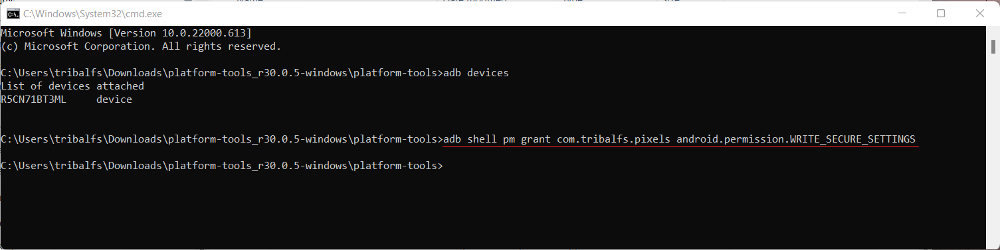

# Pixels - Smart Resolution and DPI Changer

* [Google Play Store](https://play.google.com/store/apps/details?id=com.tribalfs.pixels)

Pixels needs **WRITE_SECURE_SETTINGS** permission in order to work (this is NOT rooting).

----------------------

### TLDR

* Execute `adb shell pm grant com.tribalfs.pixels android.permission.WRITE_SECURE_SETTINGS`
* If using an android terminal app with elevated permission,
  execute `pm grant com.tribalfs.pixels android.permission.WRITE_SECURE_SETTINGS`

ADB Procedures using a PC:

----------------------

### 1. Enable developer mode in phone's settings

<details>

* Go to _Settings_ > _About phone_ > _Software information_ and tap _Build number_ multiple times
  until the developer mode is enabled.


</details>

### 2. Enable USB debugging

<details>

* Go to _Settings_ > _Developer options_ (can be _Settings_ > _System_ > _Developer options_ on
  older android versions), scroll down and find _USB debugging_ option.


#### For MIUI and some other devices,

* Turn on _USB debugging for Security Settings_ also if present in Developer option.

</details>

### 3. Download ADB on your computer

<details>

* Download ADB (platform-tools) to your computer:
  for [Windows](https://dl.google.com/android/repository/platform-tools-latest-windows.zip) |
  for [Mac](https://dl.google.com/android/repository/platform-tools-latest-darwin.zip) |
  for [Linux](https://dl.google.com/android/repository/platform-tools-latest-linux.zip)

* Extract the downloaded zip file.

</details>

### 4. Navigate to inside of `platform-tools` folder that you extracted on  Windows Explorer or Finder(macOS)

### 5. Opening the command-line interface

  <details>

#### For Windows: Open up CMD

* Type `cmd` in the address bar and press enter. This will open the Windows Command Prompt
  application.


#### For MacOS: Open up Terminal

* Search `Terminal` from Launchpad and run it.

* Run `sudo -s` and type your user password. **The terminal won't display how much characters you
  type, it'll remain blank.**

* Run `export PATH=.:$PATH`

**Without this, you will get `adb: command not found` errors.**

</details>

### 6. Connecting your phone to your computer

  <details>

* Your phone will prompt _Allow USB debugging_ if it's the first time being connected on USB
  debugging mode. Tap _Allow_ or _OK_.
* Optionally, you may want to check _Always allow from this computer_ (Please check note at the end
  of this tutorial about keeping the USB debugging enabled).


* Check the connection by entering the following command followed by an enter. It should show your
  device ID if successfully connected.

> ```adb devices```


#### For macOS:  ```./adb devices ```

* If your device fails to connect to your computer, try connecting it to a different USB port and/or
  using a different USB data cable. If still not connecting, your computer is possibly missing the
  USB driver for your phone.
  Check [here to download OEM USB drivers](https://developer.android.com/studio/run/oem-usb#Drivers).
  Once installed, reboot your PC and redo step no. 6.

</details>

### 7. Actual granting of WRITE_SECURE_SETTINGS permission to Pixels

  <details>

* When successfully connected, enter the following command and press enter. You can copy the command
  below. If the command is executed properly, it will return blank.

> ```adb shell pm grant com.tribalfs.pixels android.permission.WRITE_SECURE_SETTINGS```

* If it prompts `adb.exe: more than one device/emulator...`, execute the following instead:

> ```adb -s [device Id shown in step 6] shell pm grant com.tribalfs.pixels android.permission.WRITE_SECURE_SETTINGS```




#### For macOS: ```./adb shell pm grant com.tribalfs.pixels android.permission.WRITE_SECURE_SETTINGS ```

#### Note for MIUI, OnePlus and some other devices

* On some devices you need to enable the option _Disable permission Monitoring_ in _Developer
  options_ to be able to grant this permission. Reboot is needed.

**That's it!**
</details>

### You may now disable the USB debugging settings

* If you don't need USB debugging, you may now disable the USB debugging settings to avoid potential
  unwanted access.

* Go to _Settings_ > _Developer options_, scroll down a page and **disable** _USB debugging_ option.

* **Important**: Keep USB debugging enabled if you want to try exotic screen resolution(s) on your
  device that may potentially crash the system. _Always allow from this computer_ should be checked
  in step 6. ADB commands to reset screen resolution: `adb shell wm size reset`
  and `adb shell wm density reset`.

----------------------
[VIDEO GUIDE](https://youtu.be/hKxc8wqanxA)

----------------------


ADB Procedures Without Using a PC:
----------------------
<details>

* You can install [LADB](https://github.com/tribalfs/LADB/releases), follow its setup guide and
  execute `pm grant com.tribalfs.pixels android.permission.WRITE_SECURE_SETTINGS`

</details>

----------------------

### You don't have to repeat this process unless you completely uninstall the app and reinstall it.


