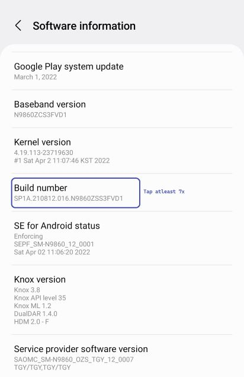
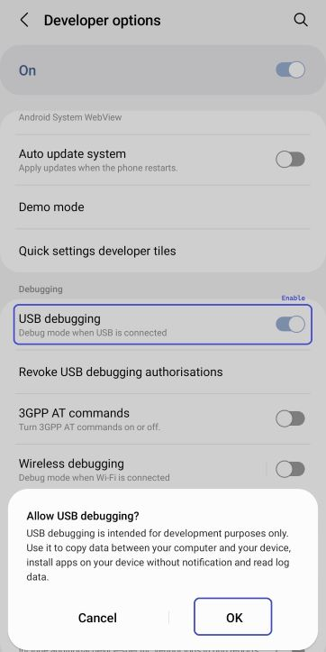
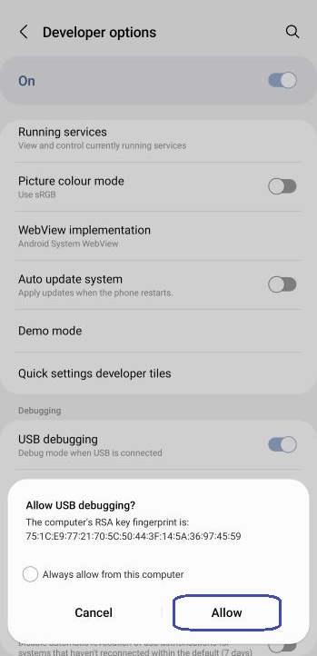

<u>[English](README.md)</u> | [Español](docs/es/README.md)
| [Português](docs/pt/README.md) | [Bahasa Indonesia](docs/in/README.md)
| [Русский](docs/ru/README.md) | [中文 (简体)](docs/zh-rCN/README.md)
| [日本語](docs/ja-rJP/README.md) | [Tiếng Việt](docs/vi/README.md)
| [Türkçe](docs/tr/README.md)
| [हिन्दी](docs/hi/README.md) | [العربية](docs/ar/README.md) | [ไทย](docs/th/README.md)

# Pixels - Smart Resolution and DPI Changer

* [Google Play Store](https://play.google.com/store/apps/details?id=com.tribalfs.pixels)

Pixels needs **WRITE_SECURE_SETTINGS** permission in order to work (this is NOT rooting).

----------------------

### TL;DR

* Execute `adb shell pm grant com.tribalfs.pixels android.permission.WRITE_SECURE_SETTINGS`.
* If using an android terminal app with elevated permission,
  execute `pm grant com.tribalfs.pixels android.permission.WRITE_SECURE_SETTINGS`.

----------------------

ADB Procedures using a PC:
----------------------

<details>

### 1. Enable developer mode in phone's settings

<details>

* Go to _Settings_ > _About phone_ > _Software information_ and tap _Build number_ successively
  seven(7) times
  to enable developer options.

  

</details>

### 2. Enable USB debugging

<details>

* Go to _Settings_ > _Developer options_ (can be _Settings_ > _System_ > _Developer options_ on
  older android versions), scroll down and find _USB debugging_ option.

  

#### Notes for some devices like MIUI:

* Turn on _USB debugging for Security Settings_ also if present in Developer option.

* Turn on _Disable permission Monitoring_ option if present in Developer options. Reboot is needed.

</details>

### 3. Download ADB on your computer

<details>

* Download ADB (platform-tools) to your computer:
  for [Windows](https://dl.google.com/android/repository/platform-tools-latest-windows.zip) |
  for [Mac](https://dl.google.com/android/repository/platform-tools-latest-darwin.zip) |
  for [Linux](https://dl.google.com/android/repository/platform-tools-latest-linux.zip)

* Extract the downloaded zip file.

</details>

### 4. Navigate to inside of

`platform-tools` folder that you extracted on Windows Explorer or Finder(macOS)

### 5. Opening the command-line interface

  <details>

#### For Windows: Open up CMD

* Type `cmd` in the address bar and press enter. This will open the Windows Command Prompt
  application.


#### For MacOS: Open up Terminal

* Search `Terminal` from Launchpad and run it.

* Run `sudo -s` and type your user password. **The terminal won't display how much characters you
  type, it'll remain blank.**

* Run `export PATH=.:$PATH`

**Without this, you will get `adb: command not found` errors.**

</details>

### 6. Connecting your phone to your computer

  <details>

* Your phone will prompt _Allow USB debugging_ if it's the first time being connected on USB
  debugging mode. Tap _Allow_ or _OK_.
* You may check _Always allow from this computer_ (Please check note at the end
  of this tutorial about keeping the USB debugging enabled).

  

* Check the connection by entering the following command followed by an enter. It should show your
  device ID if successfully connected.

> ```adb devices```


#### For macOS:  ```./adb devices ```

* If your device fails to connect to your computer, try connecting it to a different USB port and/or
  using a different USB data cable. If still not connecting, your computer is possibly missing the
  USB driver for your phone.
  Check [here to download OEM USB drivers](https://developer.android.com/studio/run/oem-usb#Drivers).
  Once installed, reboot your PC and redo step no. 6.

</details>

### 7. Actual granting of WRITE_SECURE_SETTINGS permission to Pixels

  <details>

* When successfully connected, enter the following command and press enter. You can copy the command
  below. If the command is executed properly, it will return blank.

> ```adb shell pm grant com.tribalfs.pixels android.permission.WRITE_SECURE_SETTINGS```

* If it prompts `adb.exe: more than one device/emulator...`, execute the following instead:

>
```adb -s [device Id shown in step 6] shell pm grant com.tribalfs.pixels android.permission.WRITE_SECURE_SETTINGS```


#### For macOS:

```./adb shell pm grant com.tribalfs.pixels android.permission.WRITE_SECURE_SETTINGS ```

#### Note for MIUI, OnePlus and some other devices

If you get `java.lang.SecurityException: grantRuntimePermission` Error, follow these steps:

1. Go to _Settings_ > _Developer options_ (can be _Settings_ > _System_ > _Developer options_
2. Scroll down and enable **USB Debugging (Security Settings)**
3. If any _Caution Dialogue_ appears, follow it's steps to proceed.
4. Reboot your device and try Section 7 steps again.

**That's it!**
</details>

#### You may now disable the USB debugging settings

* **Important**: Keep USB debugging enabled if you want to try exotic screen resolution(s) on your
  device that may potentially crash the system. _Always allow from this computer_ should be checked
  in step 6. ADB commands to reset screen resolution: `adb shell wm size reset`
  and `adb shell wm density reset`.

* If you don't need USB debugging, you may now disable the USB debugging settings to avoid potential
  unwanted access.

* Go to _Settings_ > _Developer options_, scroll down a page and **disable** _USB debugging_ option.

----------------------
[VIDEO GUIDE](https://youtu.be/hKxc8wqanxA)

----------------------
</details>

----------------------
ADB Procedures without using a PC:
----------------------
<details>

### Option 1: You can install [Shizuku](https://play.google.com/store/apps/details?id=moe.shizuku.privileged.api)

and activate it following the guide it provided. Then go back to _Pixels_ app to grant it permission
by applying a resolution.

### Option 2: You can install [LADB](https://github.com/tribalfs/LADB/releases)

and follow its setup guide and execute the following command:

`pm grant com.tribalfs.pixels android.permission.WRITE_SECURE_SETTINGS`

Note: This requires connecting to a wifi network. If having a java.lang.SecurityException, check
notes in step 2 above. Important: LADB sometimes it requires a few try to make it work and it may
not work on all
devices.

</details>


----------------------

### You don't have to repeat this process unless you completely uninstall the app and reinstall it.


