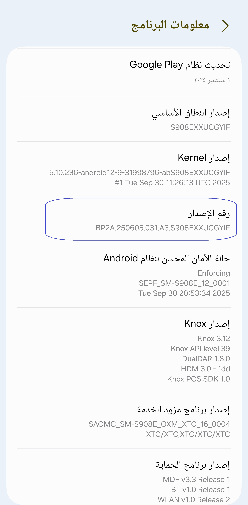
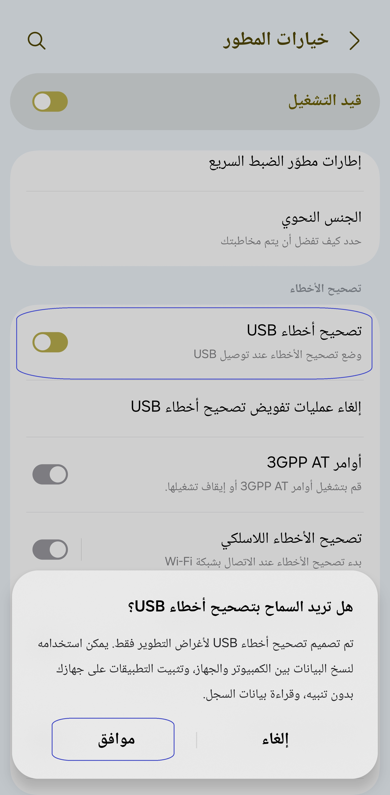
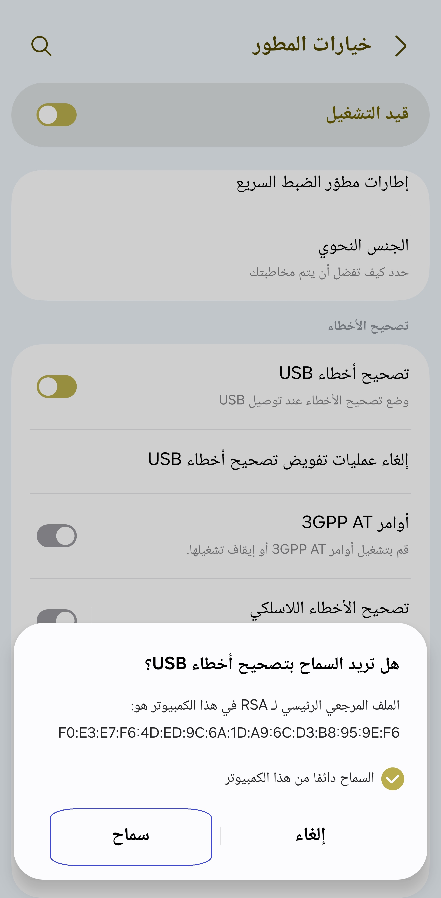

[English](../../README.md) | [Español](../es/README.md) | [Português](../pt/README.md) | [हिन्दी](../hi/README.md)
| [Bahasa Indonesia](../in/README.md) | [العربية](README.md) | [ไทย](../th/README.md)

# Pixels: Resolution+DPI Changer

* [متجر جوجل بلاي](https://play.google.com/store/apps/details?id=com.tribalfs.pixels)

يحتاج بكسل إلى إذن **WRITE_SECURE_SETTINGS** ليعمل (هذا ليس تجذيرًا).

----------------------

### TL;DR

* نفذ `adb shell pm grant com.tribalfs.pixels android.permission.WRITE_SECURE_SETTINGS`
* إذا كنت تستخدم تطبيق طرفية أندرويد بإذن مرتفع ،
  نفذ `pm grant com.tribalfs.pixels android.permission.WRITE_SECURE_SETTINGS`

----------------------

إجراءات ADB باستخدام جهاز كمبيوتر:
----------------------

<details>

### 1. قم بتمكين وضع المطور في إعدادات الهاتف

<details>

* اذهب إلى _الإعدادات_ > _حول الهاتف_ > _معلومات البرنامج_ وانقر على _رقم الإصدار_ عدة مرات
  حتى يتم تمكين وضع المطور.

  

</details>

### 2. قم بتمكين تصحيح أخطاء USB

<details>

* اذهب إلى _الإعدادات_ > _خيارات المطور_ (يمكن أن تكون _الإعدادات_ > _النظام_ > _خيارات المطور_ على
  إصدارات أندرويد الأقدم) ، قم بالتمرير لأسفل وابحث عن خيار _تصحيح أخطاء USB_.

  

#### ملاحظات لبعض الأجهزة مثل MIUI:

* قم بتشغيل _تصحيح أخطاء USB لإعدادات الأمان_ أيضًا إذا كان موجودًا في خيار المطور.

* قم بتشغيل خيار _تعطيل مراقبة الأذونات_ إذا كان موجودًا في خيارات المطور. إعادة التشغيل مطلوبة.

</details>

### 3. قم بتنزيل ADB على جهاز الكمبيوتر الخاص بك

<details>

* قم بتنزيل ADB (platform-tools) على جهاز الكمبيوتر الخاص بك:
  لـ [Windows](https://dl.google.com/android/repository/platform-tools-latest-windows.zip) |
  لـ [Mac](https://dl.google.com/android/repository/platform-tools-latest-darwin.zip) |
  لـ [Linux](https://dl.google.com/android/repository/platform-tools-latest-linux.zip)

* قم باستخراج ملف zip الذي تم تنزيله.

</details>

### 4. انتقل إلى داخل

مجلد `platform-tools` الذي قمت باستخراجه على مستكشف Windows أو Finder (macOS)

### 5. فتح واجهة سطر الأوامر

  <details>

#### بالنسبة لنظام التشغيل Windows: افتح CMD

* اكتب `cmd` في شريط العنوان واضغط على Enter. سيؤدي هذا إلى فتح تطبيق موجه أوامر Windows
  .


#### بالنسبة لنظام التشغيل MacOS: افتح Terminal

* ابحث عن `Terminal` من Launchpad وقم بتشغيله.

* قم بتشغيل `sudo -s` واكتب كلمة مرور المستخدم الخاصة بك. **لن تعرض المحطة الطرفية عدد الأحرف التي
  تكتبها ، وستبقى فارغة.**

* قم بتشغيل `export PATH=.:$PATH`

**بدون هذا ، ستحصل على أخطاء `adb: command not found`.**

</details>

### 6. توصيل هاتفك بجهاز الكمبيوتر الخاص بك

  <details>

* سيطالبك هاتفك بـ _السماح بتصحيح أخطاء USB_ إذا كانت هذه هي المرة الأولى التي يتم فيها توصيله في
  وضع تصحيح أخطاء USB
  . انقر فوق _السماح_ أو _موافق_.
* يمكنك تحديد _السماح دائمًا من هذا الكمبيوتر_ (يرجى مراجعة الملاحظة في نهاية
  هذا البرنامج التعليمي حول إبقاء تصحيح أخطاء USB ممكّنًا).

  

* تحقق من الاتصال عن طريق إدخال الأمر التالي متبوعًا بإدخال. يجب أن يظهر
  معرف جهازك إذا تم الاتصال بنجاح.

> ```adb devices```


#### بالنسبة لنظام التشغيل macOS: ```./adb devices ```

* إذا فشل جهازك في الاتصال بجهاز الكمبيوتر الخاص بك ، فحاول توصيله بمنفذ USB مختلف و / أو
  استخدام كابل بيانات USB مختلف. إذا لم يتم الاتصال بعد ، فمن المحتمل أن يكون جهاز الكمبيوتر الخاص
  بك يفتقد
  برنامج تشغيل USB لهاتفك.
  تحقق [هنا لتنزيل برامج تشغيل USB OEM](https://developer.android.com/studio/run/oem-usb#Drivers).
  بمجرد التثبيت ، أعد تشغيل جهاز الكمبيوتر الخاص بك وأعد الخطوة رقم 6.

</details>

### 7. المنح الفعلي لإذن WRITE_SECURE_SETTINGS لـ Pixels

  <details>

* عند الاتصال بنجاح ، أدخل الأمر التالي واضغط على Enter. يمكنك نسخ الأمر
  أدناه. إذا تم تنفيذ الأمر بشكل صحيح ، فسيعود فارغًا.

> ```adb shell pm grant com.tribalfs.pixels android.permission.WRITE_SECURE_SETTINGS```

* إذا طالب `adb.exe: more than one device/emulator...` ، فنفذ ما يلي بدلاً من ذلك:

>
```adb -s [معرف الجهاز الموضح في الخطوة 6] shell pm grant com.tribalfs.pixels android.permission.WRITE_SECURE_SETTINGS```


#### بالنسبة لنظام التشغيل macOS:

```./adb shell pm grant com.tribalfs.pixels android.permission.WRITE_SECURE_SETTINGS ```

#### ملاحظة لأجهزة MIUI و OnePlus وبعض الأجهزة الأخرى

إذا حصلت على خطأ `java.lang.SecurityException: grantRuntimePermission` ، فاتبع الخطوات التالية:

1. اذهب إلى _الإعدادات_ > _خيارات المطور_ (يمكن أن تكون _الإعدادات_ > _النظام_ > _خيارات المطور_
2. قم بالتمرير لأسفل وقم بتمكين **تصحيح أخطاء USB (إعدادات الأمان)**
3. إذا ظهر أي _حوار تحذير_ ، فاتبع خطواته للمتابعة.
4. أعد تشغيل جهازك وحاول خطوات القسم 7 مرة أخرى.

**هذا كل شيء!**
</details>

#### يمكنك الآن تعطيل إعدادات تصحيح أخطاء USB

* **هام**: احتفظ بتمكين تصحيح أخطاء USB إذا كنت ترغب في تجربة دقة شاشة غريبة على
  جهازك قد تتسبب في تعطل النظام. يجب تحديد _السماح دائمًا من هذا الكمبيوتر_ في
  الخطوة 6. أوامر ADB لإعادة ضبط دقة الشاشة: `adb shell wm size reset`
  و `adb shell wm density reset`.

* إذا لم تكن بحاجة إلى تصحيح أخطاء USB ، فيمكنك الآن تعطيل إعدادات تصحيح أخطاء USB لتجنب
  الوصول غير المرغوب فيه المحتمل.

* اذهب إلى _الإعدادات_ > _خيارات المطور_ ، قم بالتمرير لأسفل صفحة و **عطّل** خيار _تصحيح أخطاء USB_
  .

----------------------
[دليل الفيديو](https://youtu.be/hKxc8wqanxA)

</details>

----------------------

إجراءات ADB بدون استخدام جهاز كمبيوتر:
----------------------
<details>

## الخيارات المتاحة

### 🟢 الخيار 1

يمكنك تثبيت [Shizuku](https://play.google.com/store/apps/details?id=moe.shizuku.privileged.api)  
وتفعيله باتباع دليل الإعداد الخاص به.  
بعد ذلك، يمكنك العودة إلى تطبيق _Pixels_ لمنحه الأذونات عن طريق تطبيق دقة الشاشة.

---

### 🟣 الخيار 2

يمكنك تثبيت [LADB](https://github.com/tribalfs/LADB/releases)، واتباع دليل الإعداد الخاص به،  
ثم تنفيذ الأمر التالي:

```pm grant com.tribalfs.pixels android.permission.WRITE_SECURE_SETTINGS```

⚠️ ملاحظات

يتطلب هذا الاتصال بشبكة Wi-Fi.

إذا ظهرت رسالة الخطأ java.lang.SecurityException، تحقق من الملاحظات في الخطوة 2 أعلاه.

مهم: أحيانًا يحتاج LADB إلى عدة محاولات حتى يعمل، وقد لا يعمل على جميع الأجهزة.

</details>


----------------------

### لست مضطرًا لتكرار هذه العملية إلا إذا قمت بإلغاء تثبيت التطبيق بالكامل وإعادة تثبيته.


