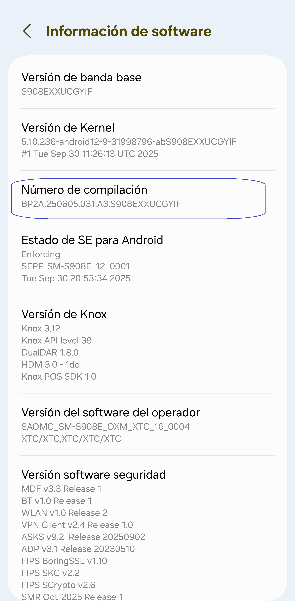
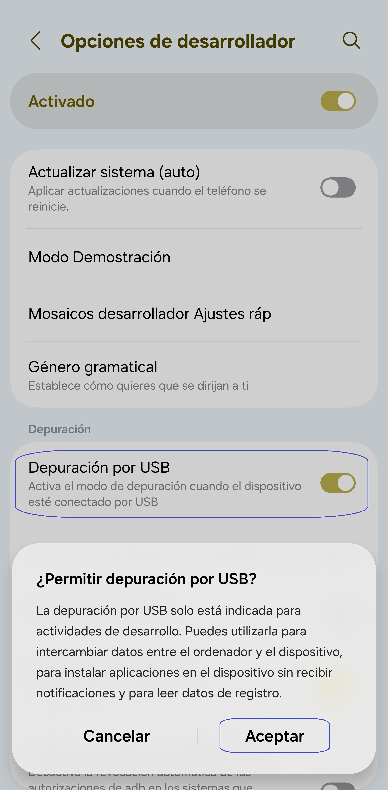
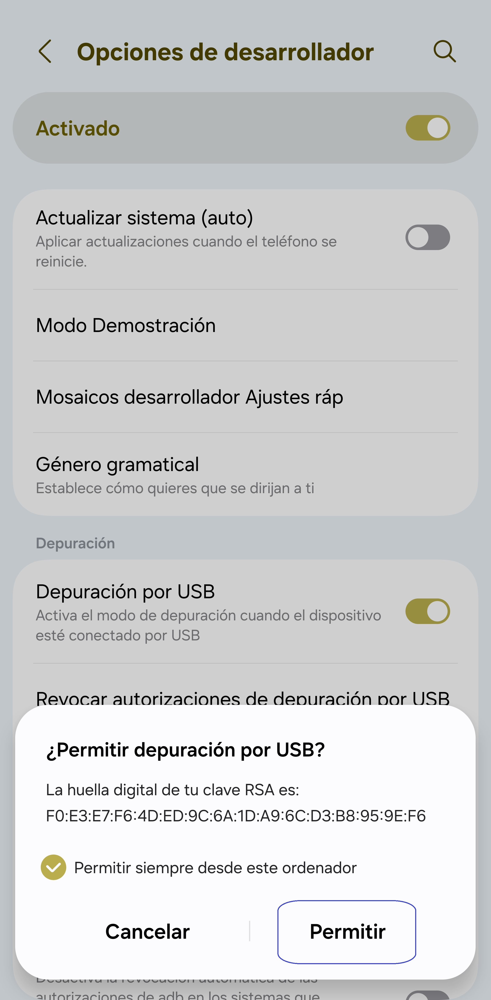

[English](../../README.md) | [Español](README.md) | [Português](../pt/README.md) | [हिन्दी](../hi/README.md)
| [Bahasa Indonesia](../in/README.md) | [العربية](../ar/README.md)| [ไทย](../th/README.md)
| [Русский](../ru/README.md) | [中文 (简体)](../zh-rCN/README.md)

# Pixels - Cambiador Inteligente de Resolución y DPI

* [Google Play Store](https://play.google.com/store/apps/details?id=com.tribalfs.pixels)

Pixels necesita el permiso **WRITE_SECURE_SETTINGS** para funcionar correctamente (esto NO es
rootear el dispositivo).

----------------------

### TL;DR

* Ejecuta `adb shell pm grant com.tribalfs.pixels android.permission.WRITE_SECURE_SETTINGS`

* Si utilizas una aplicación de terminal en Android con permisos elevados,
  ejecuta `pm grant com.tribalfs.pixels android.permission.WRITE_SECURE_SETTINGS`

----------------------

Procedimiento ADB usando un PC:
----------------------

<details>

### 1. Activa el modo desarrollador en la configuración del teléfono

<details>

* Ve a _Ajustes_ > _Acerca del teléfono_ > _Información de software_ y toca varias veces sobre
  _Número de
  compilación_ hasta que se habilite el modo desarrollador.

  

</details>

### 2. Habilita la _Depuración por USB_

<details>

* Ve a _Ajustes_ > _Opciones de desarrollador_ (o _Ajustes_ > _Sistema_ > _Opciones de
  desarrollador_ en
  versiones antiguas de Android),
  desplázate hacia abajo y activa la opción _Depuración por USB_.

  )

#### Notas para algunos dispositivos como MIUI:

* Activa también la opción _Depuración por USB para configuraciones de seguridad_ si aparece en las
  opciones de desarrollador.

* Activa la opción _Desactivar supervisión de permisos_ si está disponible. Se requiere reiniciar el
  dispositivo.

</details>

### 3. Descarga ADB en tu ordenador

<details>

* Descarga ADB (platform-tools) en tu computadora:
  para [Windows](https://dl.google.com/android/repository/platform-tools-latest-windows.zip)
  | para [Mac](https://dl.google.com/android/repository/platform-tools-latest-darwin.zip)
  | para [Linux](https://dl.google.com/android/repository/platform-tools-latest-linux.zip)

* Extrae el archivo ZIP descargado.

</details>

### 4. Navega dentro de la carpeta

`platform-tools` que extrajiste en el Explorador de Windows o Finder (macOS)

### 5. Abre la interfaz de línea de comandos

<details>

#### En Windows: Abre CMD

* Escribe `cmd` en la barra de direcciones y presiona Enter. Esto abrirá el símbolo del sistema.


#### En macOS: Abre la Terminal

* Busca `Terminal` desde Launchpad y ábrela.

* Ejecuta `sudo -s` e introduce tu contraseña de usuario. **La terminal no mostrará los caracteres
  mientras escribes.**

* Ejecuta `export PATH=.:$PATH`

**Sin esto, obtendrás errores como `adb: command not found` errors.**

</details>

### 6. Conecta tu teléfono al ordenador

<details>

* Tu teléfono mostrará el mensaje _Permitir depuración por USB_ si es la primera vez que lo
  conectas.
  Toca _Permitir_.

* Puedes marcar la casilla _Permitir siempre desde este ordenador_ (revisa la nota al final de este
  tutorial sobre mantener activada la depuración USB).



* Comprueba la conexión introduciendo el siguiente comando y presionando Enter. Debería mostrar el
  ID de tu dispositivo si la conexión fue exitosa.

> ```adb devices```


#### En macOS:  ```./adb devices ```

* Si tu dispositivo no logra conectarse, prueba con otro puerto USB o cable de datos diferente.
  Si aún así no conecta, puede que tu ordenador no tenga instalados los controladores USB del
  dispositivo.
  Consulta (aquí para descargar los controladores
  OEM)[https://developer.android.com/studio/run/oem-usb#Drivers].
  Una vez instalados, reinicia tu PC y repite el paso 6.

</details>

### 7. Otorgar el permiso WRITE_SECURE_SETTINGS a Pixels

<details>

* Una vez conectado correctamente, introduce el siguiente comando y presiona Enter.
  Puedes copiar y pegar el comando. Si se ejecuta correctamente, no mostrará ningún mensaje.

> ```adb shell pm grant com.tribalfs.pixels android.permission.WRITE_SECURE_SETTINGS```

* Si aparece el error `adb.exe: more than one device/emulator...`, ejecuta en su lugar:

>
```adb -s [ID del dispositivo mostrado en el paso 6] shell pm grant com.tribalfs.pixels android.permission.WRITE_SECURE_SETTINGS```


#### En macOS:

```./adb shell pm grant com.tribalfs.pixels android.permission.WRITE_SECURE_SETTINGS ```

#### Nota para MIUI, OnePlus y algunos otros dispositivos

Si obtienes el error `java.lang.SecurityException: grantRuntimePermission`, sigue estos pasos:

1. Ve a Ajustes > Opciones de desarrollador (o Ajustes > Sistema > Opciones de desarrollador)
2. Activa Depuración USB (Configuraciones de seguridad)
3. Si aparece algún diálogo de advertencia, sigue sus instrucciones.
4. Reinicia tu dispositivo y repite los pasos de la sección 7.

**¡Eso es todo!**

</details>

#### Ahora puedes desactivar la depuración USB

* **Importante**: Mantén la depuración USB activada si planeas probar resoluciones de pantalla poco
  comunes
  que puedan causar fallos del sistema. En el paso 6 debe estar marcada la opción Permitir siempre
  desde este ordenador.
  Comandos ADB para restablecer la resolución:
  `adb shell wm size reset`
  y
  `adb shell wm density reset`.

* Si no necesitas la depuración USB, puedes desactivarla para evitar posibles accesos no deseados:
  Ajustes > Opciones de desarrollador > Desactiva la opción Depuración USB.

[GUÍA EN VIDEO](https://youtu.be/hKxc8wqanxA)

</details>

----------------------
Procedimientos ADB sin usar una PC:
----------------------
<details>

### Opción 1: Puedes instalar [Shizuku](https://play.google.com/store/apps/details?id=moe.shizuku.privileged.api)

y activarlo siguiendo la guía proporcionada. Luego, vuelve a la aplicación _Pixels_ para otorgarle
permisos
aplicando una resolución.

### Opción 2: Puedes instalar [LADB](https://github.com/tribalfs/LADB/releases)

y seguir su guía de configuración, luego ejecutar el siguiente comando:

`pm grant com.tribalfs.pixels android.permission.WRITE_SECURE_SETTINGS`

**Nota:** Esto requiere conectarse a una red Wi-Fi.  
Si aparece un error `java.lang.SecurityException`, revisa las notas del paso 2 anterior.  
**Importante:** A veces, **LADB** necesita varios intentos para funcionar y puede que no funcione en
todos los dispositivos.
[VIDEO DEMOSTRATIVO](https://youtu.be/gdPHB9ru238)

</details>


----------------------

### No es necesario repetir este proceso a menos que desinstales completamente la aplicación y la vuelvas a instalar.
