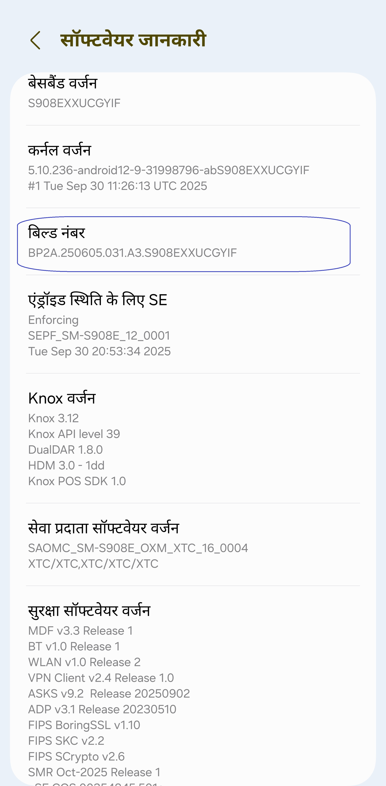
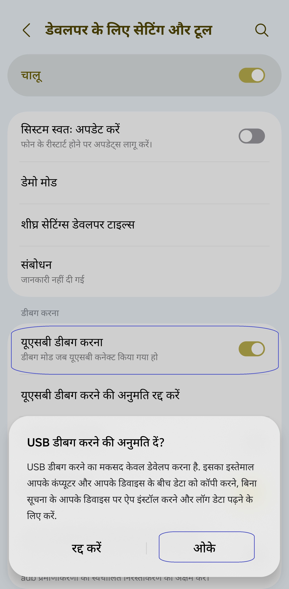
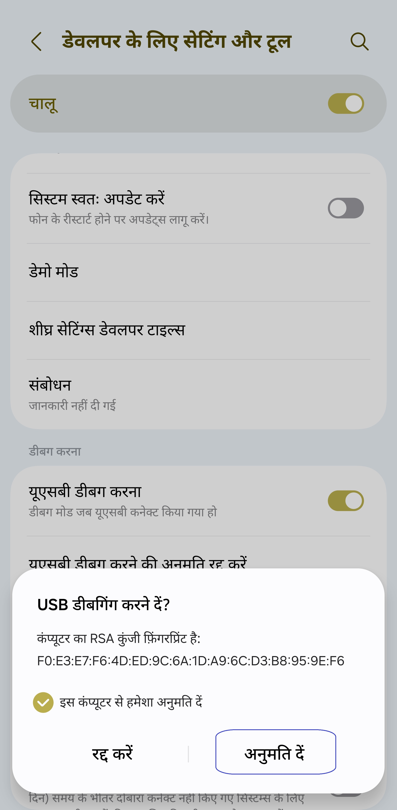

[English](../../README.md) | [Español](../es/README.md) | [Português](../pt/README.md) | [हिन्दी](README.md)
| [Bahasa Indonesia](../in/README.md) | [العربية](../ar/README.md)| [ไทย](../th/README.md)

# पिक्सेल - स्मार्ट रिज़ॉल्यूशन और डीपीआई चेंजर

* [गूगल प्ले स्टोर](https://play.google.com/store/apps/details?id=com.tribalfs.pixels)

पिक्सेल को काम करने के लिए **WRITE_SECURE_SETTINGS** अनुमति की आवश्यकता है (यह रूटिंग नहीं है)।

----------------------

### TL;DR

* `adb shell pm grant com.tribalfs.pixels android.permission.WRITE_SECURE_SETTINGS` निष्पादित करें
* यदि एलिवेटेड अनुमति वाले एंड्रॉइड टर्मिनल ऐप का उपयोग कर रहे हैं,
  `pm grant com.tribalfs.pixels android.permission.WRITE_SECURE_SETTINGS` निष्पादित करें

----------------------

पीसी का उपयोग कर एडीबी प्रक्रियाएं:
----------------------

<details>

### 1. फोन की सेटिंग्स में डेवलपर मोड सक्षम करें

<details>

* _सेटिंग्स_ > _फोन के बारे में_ > _सॉफ्टवेयर जानकारी_ पर जाएं और डेवलपर मोड सक्षम होने तक _बिल्ड
  नंबर_ पर कई बार टैप करें।
  

</details>

### 2. यूएसबी डिबगिंग सक्षम करें

<details>

* _सेटिंग्स_ > _डेवलपर विकल्प_ पर जाएं (पुराने एंड्रॉइड संस्करणों पर _सेटिंग्स_ > _सिस्टम_ > _डेवलपर
  विकल्प_ हो सकता है
  ), नीचे स्क्रॉल करें और _यूएसबी डिबगिंग_ विकल्प खोजें।

  

#### MIUI जैसे कुछ उपकरणों के लिए नोट्स:

* यदि डेवलपर विकल्प में मौजूद हो तो _सुरक्षा सेटिंग्स के लिए यूएसबी डिबगिंग_ भी चालू करें।

* यदि डेवलपर विकल्पों में मौजूद हो तो _अनुमति निगरानी अक्षम करें_ विकल्प चालू करें। रिबूट आवश्यक है।

</details>

### 3. अपने कंप्यूटर पर एडीबी डाउनलोड करें

<details>

* अपने कंप्यूटर पर एडीबी (प्लेटफॉर्म-टूल्स) डाउनलोड करें:
  [विंडोज](https://dl.google.com/android/repository/platform-tools-latest-windows.zip) के लिए |
  [मैक](https://dl.google.com/android/repository/platform-tools-latest-darwin.zip) के लिए |
  [लिनक्स](https://dl.google.com/android/repository/platform-tools-latest-linux.zip) के लिए

* डाउनलोड की गई ज़िप फ़ाइल निकालें।

</details>

### 4. के अंदर नेविगेट करें

`platform-tools` फ़ोल्डर जिसे आपने विंडोज एक्सप्लोरर या फाइंडर (macOS) पर निकाला है

### 5. कमांड-लाइन इंटरफ़ेस खोलना

  <details>

#### विंडोज के लिए: सीएमडी खोलें

* एड्रेस बार में `cmd` टाइप करें और एंटर दबाएं। यह विंडोज कमांड प्रॉम्प्ट
  एप्लिकेशन खोलेगा।


#### MacOS के लिए: टर्मिनल खोलें

* लॉन्चपैड से `टर्मिनल` खोजें और इसे चलाएं।

* `sudo -s` चलाएं और अपना उपयोगकर्ता पासवर्ड टाइप करें। **टर्मिनल यह प्रदर्शित नहीं करेगा कि आप
  कितने वर्ण
  टाइप करते हैं, यह खाली रहेगा।**

* `export PATH=.:$PATH` चलाएं

**इसके बिना, आपको `adb: command not found` त्रुटियां मिलेंगी।**

</details>

### 6. अपने फोन को अपने कंप्यूटर से कनेक्ट करना

  <details>

* यदि आपका फोन पहली बार यूएसबी डिबगिंग मोड पर कनेक्ट हो रहा है तो _यूएसबी डिबगिंग की अनुमति दें_ का
  संकेत देगा
  । _अनुमति दें_ या _ठीक है_ पर टैप करें।
* आप _इस कंप्यूटर से हमेशा अनुमति दें_ को चेक कर सकते हैं (यूएसबी डिबगिंग को सक्षम रखने के बारे में
  इस ट्यूटोरियल के अंत में नोट देखें)।

  

* निम्नलिखित कमांड दर्ज करके कनेक्शन की जांच करें और उसके बाद एंटर दबाएं। यदि सफलतापूर्वक कनेक्ट हो
  गया है तो इसे आपकी
  डिवाइस आईडी दिखानी चाहिए।

> ```adb devices```


#### macOS के लिए: ```./adb devices ```

* यदि आपका डिवाइस आपके कंप्यूटर से कनेक्ट होने में विफल रहता है, तो इसे किसी भिन्न यूएसबी पोर्ट से
  कनेक्ट करने का प्रयास करें और/या
  एक भिन्न यूएसबी डेटा केबल का उपयोग करें। यदि अभी भी कनेक्ट नहीं हो रहा है, तो संभवतः आपके कंप्यूटर
  में
  आपके फोन के लिए यूएसबी ड्राइवर नहीं है।
  [ओईएम यूएसबी ड्राइवर डाउनलोड करने के लिए यहां देखें](https://developer.android.com/studio/run/oem-usb#Drivers)।
  एक बार स्थापित हो जाने पर, अपने पीसी को रीबूट करें और चरण संख्या 6 को फिर से करें।

</details>

### 7. पिक्सेल को WRITE_SECURE_SETTINGS अनुमति का वास्तविक अनुदान

  <details>

* सफलतापूर्वक कनेक्ट होने पर, निम्न कमांड दर्ज करें और एंटर दबाएं। आप नीचे दिए गए कमांड को कॉपी कर
  सकते हैं
  । यदि कमांड ठीक से निष्पादित होता है, तो यह रिक्त वापस आ जाएगा।

> ```adb shell pm grant com.tribalfs.pixels android.permission.WRITE_SECURE_SETTINGS```

* यदि यह `adb.exe: more than one device/emulator...` संकेत देता है, तो इसके बजाय निम्नलिखित
  निष्पादित करें:

>
```adb -s [चरण 6 में दिखाई गई डिवाइस आईडी] shell pm grant com.tribalfs.pixels android.permission.WRITE_SECURE_SETTINGS```


#### macOS के लिए:

```./adb shell pm grant com.tribalfs.pixels android.permission.WRITE_SECURE_SETTINGS ```

#### MIUI, वनप्लस और कुछ अन्य उपकरणों के लिए नोट

यदि आपको `java.lang.SecurityException: grantRuntimePermission` त्रुटि मिलती है, तो इन चरणों का पालन
करें:

1. _सेटिंग्स_ > _डेवलपर विकल्प_ पर जाएं ( _सेटिंग्स_ > _सिस्टम_ > _डेवलपर विकल्प_ हो सकता है
2. नीचे स्क्रॉल करें और **यूएसबी डिबगिंग (सुरक्षा सेटिंग्स)** सक्षम करें
3. यदि कोई _सावधानी संवाद_ प्रकट होता है, तो आगे बढ़ने के लिए उसके चरणों का पालन करें।
4. अपने डिवाइस को रीबूट करें और फिर से अनुभाग 7 के चरणों का प्रयास करें।

**बस इतना ही!**
</details>

#### अब आप यूएसबी डिबगिंग सेटिंग्स को अक्षम कर सकते हैं

* **महत्वपूर्ण**: यदि आप अपने
  डिवाइस पर विदेशी स्क्रीन रिज़ॉल्यूशन (ओं) को आज़माना चाहते हैं जो संभावित रूप से सिस्टम को क्रैश
  कर सकता है तो यूएसबी डिबगिंग को सक्षम रखें। चरण 6 में _इस कंप्यूटर से हमेशा अनुमति दें_ को चेक
  किया जाना चाहिए
  । स्क्रीन रिज़ॉल्यूशन रीसेट करने के लिए एडीबी कमांड: `adb shell wm size reset`
  और `adb shell wm density reset`।

* यदि आपको यूएसबी डिबगिंग की आवश्यकता नहीं है, तो अब आप संभावित
  अवांछित पहुंच से बचने के लिए यूएसबी डिबगिंग सेटिंग्स को अक्षम कर सकते हैं।

* _सेटिंग्स_ > _डेवलपर विकल्प_ पर जाएं, एक पृष्ठ नीचे स्क्रॉल करें और _यूएसबी डिबगिंग_ विकल्प को *
  *अक्षम** करें
  ।

----------------------
[वीडियो गाइड](https://youtu.be/hKxc8wqanxA)

</details>

----------------------

पीसी का उपयोग किए बिना ADB प्रक्रियाएँ:
----------------------
<details>

### विकल्प 1: आप [Shizuku](https://play.google.com/store/apps/details?id=moe.shizuku.privileged.api) इंस्टॉल कर सकते हैं

और दिए गए निर्देशों का पालन करके इसे सक्रिय कर सकते हैं।  
इसके बाद, _Pixels_ ऐप पर वापस जाएँ और रेज़ोल्यूशन लागू करके इसे अनुमति दें।

### विकल्प 2: आप [LADB](https://github.com/tribalfs/LADB/releases) इंस्टॉल कर सकते हैं

इसकी सेटअप गाइड का पालन करें और निम्नलिखित कमांड चलाएँ:

`pm grant com.tribalfs.pixels android.permission.WRITE_SECURE_SETTINGS`

**नोट:** इसके लिए Wi-Fi नेटवर्क से कनेक्शन आवश्यक है।  
यदि `java.lang.SecurityException` त्रुटि आती है, तो ऊपर दिए गए **स्टेप 2** के नोट्स की जाँच करें।  
**महत्वपूर्ण:** कभी-कभी **LADB** को काम करने के लिए कई बार प्रयास करना पड़ता है, और यह सभी उपकरणों
पर काम नहीं कर सकता।
[वीडियो वॉकथ्रू](https://youtu.be/gdPHB9ru238)

</details>


----------------------

### आपको इस प्रक्रिया को दोहराने की आवश्यकता नहीं है जब तक कि आप ऐप को पूरी तरह से अनइंस्टॉल और पुनः इंस्टॉल न करें।


