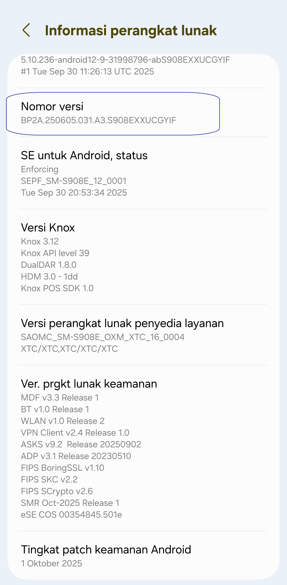
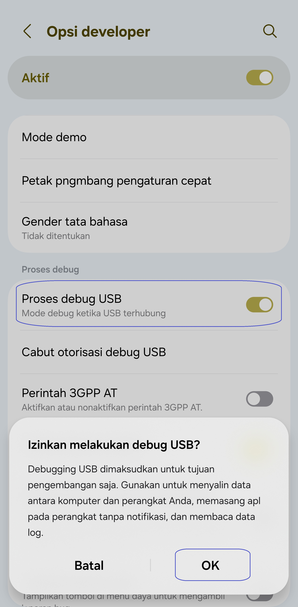
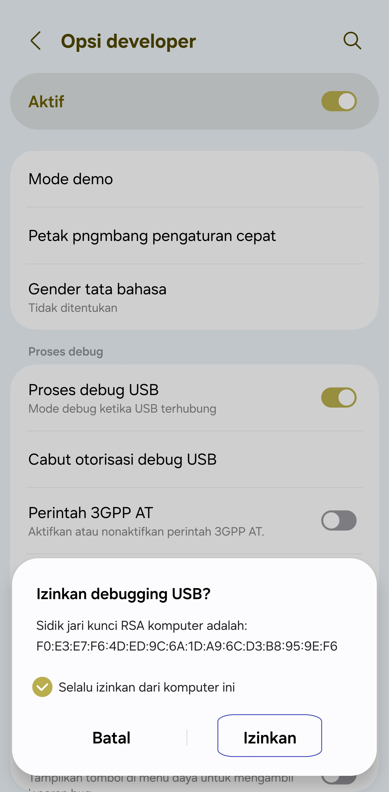
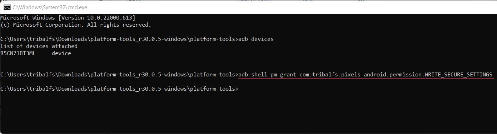

[English](../../README.md) | [Español](../es/README.md)
| [Português](../pt/README.md) | <u>[Bahasa Indonesia](README.md)</u>
| [Русский](../ru/README.md) | [中文 (简体)](../zh-rCN/README.md)
| [日本語](../ja-rJP/README.md) | [Tiếng Việt](../vi/README.md)
| [Türkçe](../tr/README.md)
| [हिन्दी](../hi/README.md) | [العربية](../ar/README.md) | [ไทย](../th/README.md)

# Pixels - Pengubah Resolusi dan DPI Cerdas

* [Google Play Store](https://play.google.com/store/apps/details?id=com.tribalfs.pixels)

Pixel memerlukan izin **WRITE_SECURE_SETTINGS** untuk berfungsi (ini BUKAN rooting).

----------------------

### TL;DR

* Jalankan `adb shell pm grant com.tribalfs.pixels android.permission.WRITE_SECURE_SETTINGS`
* Jika menggunakan aplikasi terminal android dengan izin yang lebih tinggi,
  jalankan `pm grant com.tribalfs.pixels android.permission.WRITE_SECURE_SETTINGS`

----------------------

Prosedur ADB menggunakan PC:
----------------------

<details>

### 1. Aktifkan mode pengembang di pengaturan telepon

<details>

* Buka _Pengaturan_ > _Tentang ponsel_ > _Informasi perangkat lunak_ dan ketuk _Nomor versi_ secara
  berurutan tujuh (7) kali untuk mengaktifkan opsi pengembang.

  

</details>

### 2. Aktifkan debugging USB

<details>

* Buka _Pengaturan_ > _Opsi developer_ (bisa _Pengaturan_ > _Sistem_ > _Opsi developer_ di
  versi android yang lebih lama), gulir ke bawah dan temukan opsi _Process debug USB_.

  

#### Catatan untuk beberapa perangkat seperti MIUI:

* Aktifkan juga _Process debug USB untuk Pengaturan Keamanan_ jika ada di opsi Pengembang.

* Aktifkan opsi _Nonaktifkan Pemantauan izin_ jika ada di Opsi pengembang. Diperlukan boot ulang.

</details>

### 3. Unduh ADB di komputer Anda

<details>

* Unduh ADB (platform-tools) ke komputer Anda:
  untuk [Windows](https://dl.google.com/android/repository/platform-tools-latest-windows.zip) |
  untuk [Mac](https://dl.google.com/android/repository/platform-tools-latest-darwin.zip) |
  untuk [Linux](https://dl.google.com/android/repository/platform-tools-latest-linux.zip)

* Ekstrak file zip yang diunduh.

</details>

### 4. Navigasi ke dalam folder

`platform-tools` yang Anda ekstrak di Windows Explorer atau Finder(macOS)

### 5. Membuka antarmuka baris perintah

  <details>

#### Untuk Windows: Buka CMD

* Ketik `cmd` di bilah alamat dan tekan enter. Ini akan membuka aplikasi Windows Command Prompt
  .

  

#### Untuk MacOS: Buka Terminal

* Cari `Terminal` dari Launchpad dan jalankan.

* Jalankan `sudo -s` dan ketik kata sandi pengguna Anda. **Terminal tidak akan menampilkan berapa
  banyak karakter yang Anda
  ketik, itu akan tetap kosong.**

* Jalankan `export PATH=.:$PATH`

**Tanpa ini, Anda akan mendapatkan kesalahan `adb: command not found`.**

</details>

### 6. Menghubungkan ponsel Anda ke komputer Anda

  <details>

* Ponsel Anda akan meminta _Izinkan debugging USB_ jika ini pertama kalinya terhubung pada mode
  debugging USB
  . Ketuk _Izinkan_ atau _OK_.
* Anda dapat mencentang _Selalu izinkan dari komputer ini_ (Silakan periksa catatan di akhir
  tutorial ini tentang menjaga debugging USB tetap aktif).
* 

* Periksa koneksi dengan memasukkan perintah berikut diikuti dengan enter. Ini akan menampilkan
  ID perangkat Anda jika berhasil terhubung.

> ```adb devices```


#### Untuk macOS: ```./adb devices ```

* Jika perangkat Anda gagal terhubung ke komputer Anda, coba sambungkan ke port USB yang berbeda
  dan/atau
  menggunakan kabel data USB yang berbeda. Jika masih tidak terhubung, kemungkinan komputer Anda
  kehilangan
  driver USB untuk ponsel Anda.
  Periksa [di sini untuk mengunduh driver USB OEM](https://developer.android.com/studio/run/oem-usb#Drivers).
  Setelah terinstal, boot ulang PC Anda dan ulangi langkah no. 6.

</details>

### 7. Pemberian izin WRITE_SECURE_SETTINGS yang sebenarnya ke Piksel

  <details>

* Ketika berhasil terhubung, masukkan perintah berikut dan tekan enter. Anda dapat menyalin perintah
  di bawah ini. Jika perintah dijalankan dengan benar, itu akan kembali kosong.

> ```adb shell pm grant com.tribalfs.pixels android.permission.WRITE_SECURE_SETTINGS```

* Jika muncul `adb.exe: more than one device/emulator...`, jalankan yang berikut ini sebagai
  gantinya:

>
```adb -s [ID perangkat yang ditampilkan di langkah 6] shell pm grant com.tribalfs.pixels android.permission.WRITE_SECURE_SETTINGS```



#### Untuk macOS:

```./adb shell pm grant com.tribalfs.pixels android.permission.WRITE_SECURE_SETTINGS ```

#### Catatan untuk MIUI, OnePlus dan beberapa perangkat lainnya

Jika Anda mendapatkan Kesalahan `java.lang.SecurityException: grantRuntimePermission`, ikuti
langkah-langkah berikut:

1. Buka _Pengaturan_ > _Opsi pengembang_ (bisa _Pengaturan_ > _Sistem_ > _Opsi pengembang_
2. Gulir ke bawah dan aktifkan **Debugging USB (Pengaturan Keamanan)**
3. Jika ada _Dialog Peringatan_ yang muncul, ikuti langkah-langkahnya untuk melanjutkan.
4. Boot ulang perangkat Anda dan coba lagi langkah-langkah Bagian 7.

**Selesai!**
</details>

#### Anda sekarang dapat menonaktifkan pengaturan debugging USB

* **Penting**: Biarkan debugging USB tetap aktif jika Anda ingin mencoba resolusi layar eksotis di
  perangkat Anda yang berpotensi merusak sistem. _Selalu izinkan dari komputer ini_ harus dicentang
  di langkah 6. Perintah ADB untuk mengatur ulang resolusi layar: `adb shell wm size reset`
  dan `adb shell wm density reset`.

* Jika Anda tidak memerlukan debugging USB, Anda sekarang dapat menonaktifkan pengaturan debugging
  USB untuk menghindari potensi
  akses yang tidak diinginkan.

* Buka _Pengaturan_ > _Opsi pengembang_, gulir ke bawah halaman dan **nonaktifkan** opsi _Debugging
  USB_
  .

----------------------
[PANDUAN VIDEO](https://youtu.be/hKxc8wqanxA)

</details>

----------------------

Prosedur ADB Tanpa Menggunakan PC:
----------------------
<details>

### Opsi 1: Kamu dapat menginstal [Shizuku](https://play.google.com/store/apps/details?id=moe.shizuku.privileged.api)

dan mengaktifkannya dengan mengikuti panduan yang disediakan.  
Setelah itu, kembali ke aplikasi _Pixels_ untuk memberikan izin dengan menerapkan resolusi.

### Opsi 2: Kamu dapat menginstal [LADB](https://github.com/tribalfs/LADB/releases)

ikuti panduan pengaturannya dan jalankan perintah berikut:

`pm grant com.tribalfs.pixels android.permission.WRITE_SECURE_SETTINGS`

**Catatan:** Ini memerlukan koneksi ke jaringan Wi-Fi.  
Jika terjadi kesalahan `java.lang.SecurityException`, periksa catatan pada **langkah 2** di atas.  
**Penting:** Kadang-kadang **LADB** memerlukan beberapa kali percobaan untuk berfungsi, dan mungkin
tidak bekerja di semua perangkat.
[VIDEO WALKTHROUGH](https://youtu.be/gdPHB9ru238)

</details>


----------------------

### Anda tidak perlu mengulangi proses ini kecuali Anda menghapus instalan aplikasi sepenuhnya dan menginstalnya kembali.


