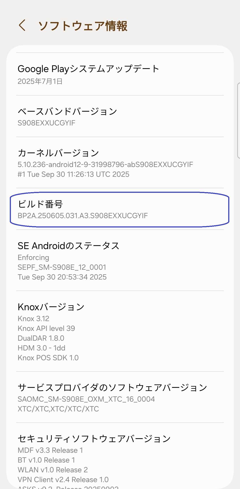
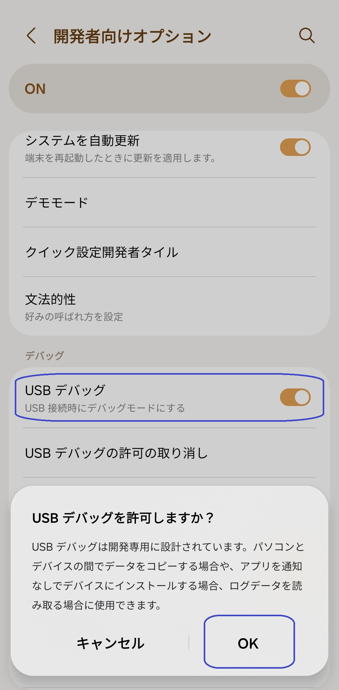
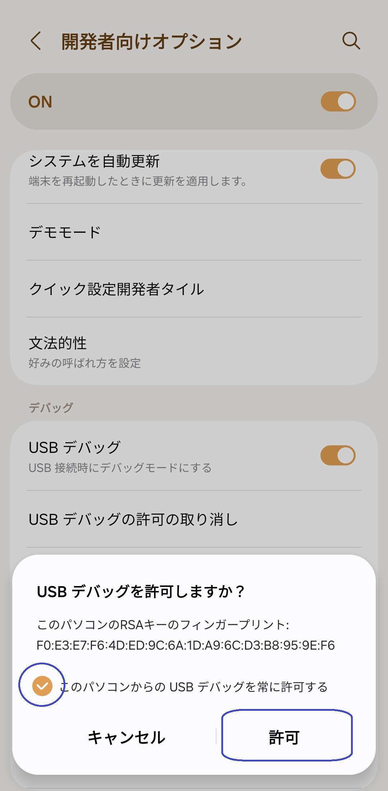

[English](../../README.md) | [Español](../es/README.md)
| [Português](../pt/README.md) | [Bahasa Indonesia](../in/README.md)
| [Русский](../ru/README.md) | [中文 (简体)](../zh-rCN/README.md)
| <u>[日本語](README.md)</u> | [Tiếng Việt](../vi/README.md)
| [Türkçe](../tr/README.md)
| [हिन्दी](../hi/README.md) | [العربية](../ar/README.md) | [ไทย](../th/README.md)

# Pixels - スマートな解像度とDPIチェンジャー

* [Google Playストア](https://play.google.com/store/apps/details?id=com.tribalfs.pixels)

Pixelsが動作するには、**WRITE_SECURE_SETTINGS**権限が必要です（これはroot化ではありません）。

----------------------

### 要約

* `adb shell pm grant com.tribalfs.pixels android.permission.WRITE_SECURE_SETTINGS` を実行します。
* 昇格された権限を持つAndroidターミナルアプリを使用している場合は、
  `pm grant com.tribalfs.pixels android.permission.WRITE_SECURE_SETTINGS` を実行します。

----------------------

PCを使用したADBの手順：
----------------------

<details>

### 1. スマートフォンの設定で開発者モードを有効にする

<details>

* _設定_ > _端末情報_ > _ソフトウェア情報_ に移動し、開発者向けオプションを有効にするために
  _ビルド番号_ を連続して7回タップします。

  

</details>

### 2. USBデバッグを有効にする

<details>

* _設定_ > _開発者向けオプション_（古いAndroidバージョンでは _設定_ > _システム_ >
  _開発者向けオプション_ の場合があります）
  に移動し、下にスクロールして _USBデバッグ_ オプションを見つけます。

  

#### MIUIなどの一部のデバイスに関する注意：

* 開発者向けオプションに _USBデバッグ（セキュリティ設定）_ がある場合は、それもオンにします。

* 開発者向けオプションに _権限モニタリングを無効にする_ オプションがある場合は、オンにします。再起動が必要です。

</details>

### 3. コンピューターにADBをダウンロードする

<details>

* ADB（platform-tools）をコンピューターにダウンロードします：
  [Windows](https://dl.google.com/android/repository/platform-tools-latest-windows.zip)用 |
  [Mac](https://dl.google.com/android/repository/platform-tools-latest-darwin.zip)用 |
  [Linux](https://dl.google.com/android/repository/platform-tools-latest-linux.zip)用

* ダウンロードしたzipファイルを解凍します。

</details>

### 4. WindowsエクスプローラーまたはFinder（macOS）で解凍した`platform-tools`フォルダーに移動します

### 5. コマンドラインインターフェイスを開く

  <details>

#### Windowsの場合：CMDを開く

* アドレスバーに `cmd` と入力してEnterキーを押します。これにより、Windowsコマンドプロンプトアプリケーションが開きます。

  

#### macOSの場合：ターミナルを開く

* Launchpadから`ターミナル`を検索して実行します。

* `sudo -s` を実行し、ユーザーパスワードを入力します。**ターミナルには入力した文字数は表示されず、空白のままになります。
  **

* `export PATH=.:$PATH` を実行します

**これを実行しないと、`adb: command not found`エラーが発生します。**

</details>

### 6. スマートフォンをコンピューターに接続する

  <details>

* USBデバッグモードで初めて接続する場合、スマートフォンに _USBデバッグを許可しますか？_
  というプロンプトが表示されます。_許可_ または _OK_ をタップします。
* _このコンピューターから常に許可する_
  にチェックを入れることもできます（USBデバッグを有効に保つことに関するチュートリアルの最後にある注意を確認してください）。
* 

* 次のコマンドを入力してEnterキーを押し、接続を確認します。正常に接続されると、デバイスIDが表示されます。

> ```adb devices```


#### macOSの場合：  ```./adb devices ```

*

デバイスがコンピューターに接続できない場合は、別のUSBポートに接続するか、別のUSBデータケーブルを使用してみてください。それでも接続できない場合は、コンピューターにスマートフォンのUSBドライバーがない可能性があります。[こちらからOEM USBドライバーをダウンロード](https://developer.android.com/studio/run/oem-usb#Drivers)
してください。インストール後、PCを再起動して手順6をやり直してください。

</details>

### 7. PixelsへのWRITE_SECURE_SETTINGS権限の実際の付与

  <details>

* 正常に接続されたら、次のコマンドを入力してEnterキーを押します。以下のコマンドをコピーできます。コマンドが正しく実行されると、何も表示されません。

> ```adb shell pm grant com.tribalfs.pixels android.permission.WRITE_SECURE_SETTINGS```

* `adb.exe: more than one device/emulator...` というプロンプトが表示された場合は、代わりに次のコマンドを実行します。

>
```adb -s [手順6で表示されたデバイスID] shell pm grant com.tribalfs.pixels android.permission.WRITE_SECURE_SETTINGS```


#### macOSの場合：

```./adb shell pm grant com.tribalfs.pixels android.permission.WRITE_SECURE_SETTINGS ```

#### MIUI, OnePlus, その他のデバイスに関する注意

`java.lang.SecurityException: grantRuntimePermission` エラーが発生した場合は、次の手順に従ってください。

1. _設定_ > _開発者向けオプション_ (または _設定_ > _システム_ > _開発者向けオプション_) に移動します
2. 下にスクロールして **USBデバッグ (セキュリティ設定)** を有効にします
3. _注意ダイアログ_ が表示された場合は、その手順に従って続行します。
4. デバイスを再起動し、セクション7の手順を再試行してください。

**以上です！**
</details>

#### これでUSBデバッグ設定を無効にできます

* **重要**: システムをクラッシュさせる可能性のある特殊な画面解像度をデバイスで試したい場合は、USBデバッグを有効にしておいてください。手順6で
  _このコンピューターから常に許可する_ にチェックを入れる必要があります。画面解像度をリセットするためのADBコマンド：
  `adb shell wm size reset` および `adb shell wm density reset`。

* USBデバッグが不要な場合は、潜在的な不要なアクセスを避けるためにUSBデバッグ設定を無効にすることができます。

* _設定_ > _開発者向けオプション_ に移動し、ページを下にスクロールして _USBデバッグ_ オプションを *
  *無効** にします。

----------------------
[ビデオガイド](https://youtu.be/hKxc8wqanxA)

----------------------
</details>

----------------------
PCを使用しないADBの手順：
----------------------
<details>

### オプション1：[Shizuku](https://play.google.com/store/apps/details?id=moe.shizuku.privileged.api)をインストールし、提供されているガイドに従ってアクティブ化します。その後、_Pixels_アプリに戻り、解像度を適用して権限を付与します。

### オプション2：[LADB](https://github.com/tribalfs/LADB/releases)をインストールし、セットアップガイドに従って次のコマンドを実行します：

`pm grant com.tribalfs.pixels android.permission.WRITE_SECURE_SETTINGS`

注：これにはWi-Fiネットワークへの接続が必要です。java.lang.SecurityExceptionが発生した場合は、上記の手順2の注意を確認してください。重要：LADBは、動作させるために数回の試行が必要な場合があり、すべてのデバイスで動作するとは限りません。

</details>


----------------------

### アプリを完全にアンインストールして再インストールしない限り、このプロセスを繰り返す必要はありません。

