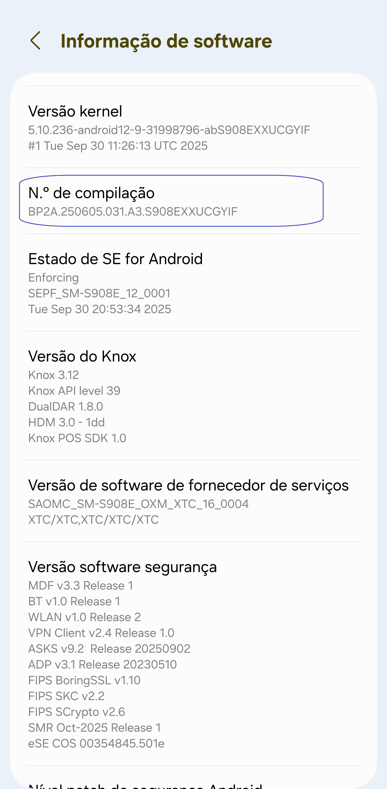
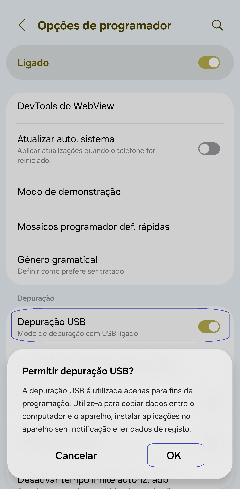
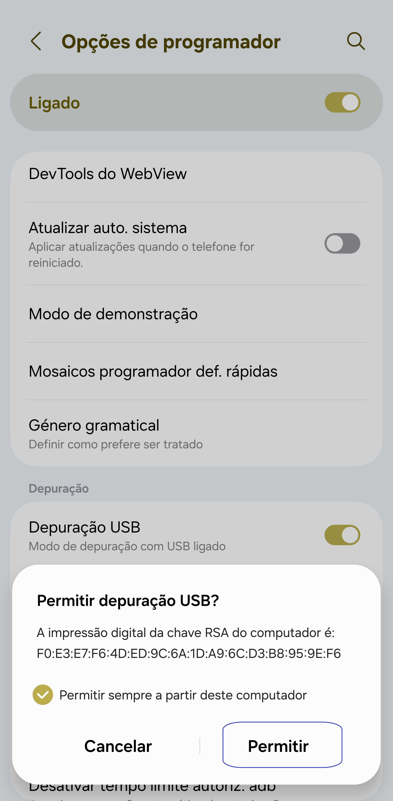

[English](../../README.md) | [Español](../es/README.md)
| <u>[Português](README.md)</u> | [Bahasa Indonesia](../in/README.md)
| [Русский](../ru/README.md) | [中文 (简体)](../zh-rCN/README.md)
| [日本語](../ja-rJP/README.md) | [Tiếng Việt](../vi/README.md)
| [हिन्दी](../hi/README.md) | [العربية](../ar/README.md) | [ไทย](../th/README.md)

# Pixels - Alterador Inteligente de Resolução e DPI

* [Google Play Store](https://play.google.com/store/apps/details?id=com.tribalfs.pixels)

O Pixels necessita da permissão **WRITE_SECURE_SETTINGS** para funcionar (isto **NÃO** é root).

----------------------

### TL;DR

* Executa `adb shell pm grant com.tribalfs.pixels android.permission.WRITE_SECURE_SETTINGS`.
* Se estiveres a usar uma aplicação de terminal Android com permissões elevadas, executa  
  `pm grant com.tribalfs.pixels android.permission.WRITE_SECURE_SETTINGS`.

----------------------

Procedimentos ADB usando um PC:
----------------------

<details>

### 1. Ativar o modo de programador nas definições do telemóvel

<details>

* Vai a _Definições_ > _Acerca do telefone_ > _Informações de software_ e toca várias vezes em
  _Número da compilação_  
  até que o modo de programador seja ativado.

  

</details>

### 2. Ativar a depuração USB

<details>

* Vai a _Definições_ > _Opções de programador_ (pode ser _Definições_ > _Sistema_ > _Opções de
  programador_ em versões mais antigas do Android),  
  desce até encontrar a opção _Depuração USB_.

  

#### Notas para alguns dispositivos como MIUI:

* Ativa também a opção _Depuração USB para Definições de Segurança_ se estiver disponível em Opções
  de programador.

* Ativa a opção _Desativar monitorização de permissões_ se estiver presente. É necessário reiniciar
  o dispositivo.

</details>

### 3. Fazer o download do ADB no computador

<details>

* Faz download do ADB (platform-tools) para o teu computador:  
  para [Windows](https://dl.google.com/android/repository/platform-tools-latest-windows.zip) |  
  para [Mac](https://dl.google.com/android/repository/platform-tools-latest-darwin.zip) |  
  para [Linux](https://dl.google.com/android/repository/platform-tools-latest-linux.zip)

* Extrai o ficheiro ZIP descarregado.

</details>

### 4. Navegar até dentro da pasta acede à pasta

`platform-tools` que extraíste no Explorador do Windows ou Finder (macOS)

### 5. Abrir o terminal de comandos

<details>

#### Para Windows: abrir o CMD

* Escreve `cmd` na barra de endereço e pressiona Enter. Isto abrirá o Prompt de Comando do Windows.

  

#### Para macOS: abrir o Terminal

* Pesquisa por `Terminal` no Launchpad e abre-o.

* Executa `sudo -s` e introduz a tua palavra-passe de utilizador.  
  **O terminal não mostrará os caracteres que escreves, o campo permanecerá em branco.**

* Executa `export PATH=.:$PATH`

**Sem este comando, irás obter erros do tipo `adb: command not found`.**

</details>

### 6. Ligar o telemóvel ao computador

<details>

* O teu telemóvel mostrará um aviso _Permitir depuração USB_ na primeira ligação em modo de
  depuração.  
  Toca em _Permitir_ ou _OK_.
* Podes marcar _Permitir sempre a partir deste computador_ (ver nota no final sobre manter a
  depuração USB ativada).

  

* Verifica a ligação introduzindo o seguinte comando e pressionando Enter.  
  Deverá mostrar o ID do dispositivo se estiver ligado com sucesso.

> ```adb devices```


#### Para macOS:  ```./adb devices ```

* Se o teu dispositivo não se ligar, tenta outra porta USB e/ou outro cabo de dados.  
  Se ainda assim não funcionar, o computador pode estar a faltar o driver USB do dispositivo.  
  Consulta [aqui os drivers OEM USB](https://developer.android.com/studio/run/oem-usb#Drivers).  
  Após instalar, reinicia o PC e repete o passo 6.

</details>

### 7. Conceder a permissão WRITE_SECURE_SETTINGS ao Pixels

<details>

* Quando estiver ligado corretamente, introduz o seguinte comando e pressiona Enter.  
  Podes copiar o comando abaixo. Se for executado corretamente, não mostrará nenhum resultado.

> ```adb shell pm grant com.tribalfs.pixels android.permission.WRITE_SECURE_SETTINGS```

* Se aparecer `adb.exe: more than one device/emulator...`, executa o seguinte comando:

>
```adb -s [ID do dispositivo mostrado no passo 6] shell pm grant com.tribalfs.pixels android.permission.WRITE_SECURE_SETTINGS```


#### Para macOS:

```./adb shell pm grant com.tribalfs.pixels android.permission.WRITE_SECURE_SETTINGS ```

#### Nota para MIUI, OnePlus e outros dispositivos

Se aparecer o erro `java.lang.SecurityException: grantRuntimePermission`, segue estes passos:

1. Vai a _Definições_ > _Opções de programador_ (ou _Definições_ > _Sistema_ > _Opções de
   programador_)
2. Desce até encontrar e ativa **Depuração USB (Definições de Segurança)**
3. Se aparecer algum _Aviso de Cautela_, segue as instruções indicadas.
4. Reinicia o dispositivo e repete os passos da Secção 7.

**Está feito!**
</details>

#### Agora podes desativar a depuração USB

* **Importante:** Mantém a depuração USB ativada se quiseres experimentar resoluções de ecrã
  exóticas que possam causar falhas no sistema.  
  A opção _Permitir sempre a partir deste computador_ deve estar marcada no passo 6.  
  Comandos ADB para repor a resolução do ecrã:  
  `adb shell wm size reset` e `adb shell wm density reset`.

* Se não precisares da depuração USB, podes desativá-la agora para evitar acessos indesejados.

* Vai a _Definições_ > _Opções de programador_, desce e **desativa** a opção _Depuração USB_.

----------------------
[GUIA EM VÍDEO](https://youtu.be/hKxc8wqanxA)

</details>

----------------------

Procedimentos ADB sem usar um PC:
----------------------
<details>

### Opção 1: Podes instalar [Shizuku](https://play.google.com/store/apps/details?id=moe.shizuku.privileged.api)

e ativá-lo seguindo o guia fornecido. Depois, volta à aplicação _Pixels_ para conceder a permissão
aplicando uma resolução.

### Opção 2: Podes instalar [LADB](https://github.com/tribalfs/LADB/releases)

segue o guia de configuração e executa o seguinte comando:

`pm grant com.tribalfs.pixels android.permission.WRITE_SECURE_SETTINGS`

**Nota:** É necessário estar ligado a uma rede Wi-Fi.  
Se ocorrer um erro `java.lang.SecurityException`, verifica as notas do passo 2 acima.  
**Importante:** Às vezes o **LADB** precisa de várias tentativas para funcionar, e pode não
funcionar em todos os dispositivos.

</details>

----------------------

### Não precisas repetir este processo, a menos que desinstales completamente a aplicação e a voltes a instalar.
