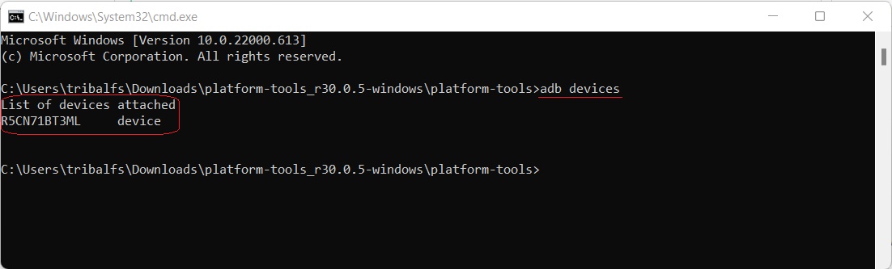

[English](../../README.md) | [Español](../es/README.md)
| [Português](../pt/README.md) | [Bahasa Indonesia](../in/README.md)
| <u>[Русский](README.md)</u> | [中文 (简体)](../zh-rCN/README.md)
| [日本語](../ja-rJP/README.md) | [Tiếng Việt](../vi/README.md)
| [Türkçe](../tr/README.md)
| [हिन्दी](../hi/README.md) | [العربية](../ar/README.md) | [ไทย](../th/README.md)

# Pixels - Умное изменение разрешения и DPI

* [Google Play Store](https://play.google.com/store/apps/details?id=com.tribalfs.pixels)

Pixels требуется разрешение **WRITE_SECURE_SETTINGS** для работы (это НЕ root-права).

----------------------

### TL;DR

* Выполните `adb shell pm grant com.tribalfs.pixels android.permission.WRITE_SECURE_SETTINGS`.
* Если вы используете приложение терминала Android с повышенными привилегиями,
  выполните `pm grant com.tribalfs.pixels android.permission.WRITE_SECURE_SETTINGS`.

----------------------

Процедуры ADB с использованием ПК:
----------------------

<details>

### 1. Включите режим разработчика в настройках телефона

<details>

* Перейдите в _Настройки_ > _Сведения о телефоне_ > _Сведения о ПО_ и нажмите _Номер сборки_
  последовательно семь (7) раз, чтобы включить параметры разработчика.

  

</details>

### 2. Включите отладку по USB

<details>

* Перейдите в _Настройки_ > _Для разработчиков_ (может быть _Настройки_ > _Система_ >
  _Для разработчиков_ на
  старых версиях Android), прокрутите вниз и найдите опцию _Отладка по USB_.

  

#### Примечания для некоторых устройств, таких как MIUI:

* Включите также _Отладка по USB (настройки безопасности)_, если она присутствует в параметрах
  разработчика.

* Включите опцию _Отключить мониторинг разрешений_, если она присутствует в параметрах разработчика.
  Требуется перезагрузка.

</details>

### 3. Загрузите ADB на свой компьютер

<details>

* Загрузите ADB (platform-tools) на свой компьютер:
  для [Windows](https://dl.google.com/android/repository/platform-tools-latest-windows.zip) |
  для [Mac](https://dl.google.com/android/repository/platform-tools-latest-darwin.zip) |
  для [Linux](https://dl.google.com/android/repository/platform-tools-latest-linux.zip)

* Распакуйте загруженный zip-архив.

</details>

### 4. Перейдите внутрь папки

`platform-tools`, которую вы извлекли в проводнике Windows или Finder (macOS)

### 5. Открытие интерфейса командной строки

  <details>

#### Для Windows: Откройте CMD

* Введите `cmd` в адресной строке и нажмите Enter. Это откроет приложение командной строки Windows.

  

#### Для MacOS: Откройте терминал

* Найдите `Terminal` в Launchpad и запустите его.

* Выполните `sudo -s` и введите пароль пользователя. **Терминал не будет отображать, сколько
  символов вы
  вводите, он останется пустым.**

* Выполните `export PATH=.:$PATH`

**Без этого вы получите ошибки `adb: command not found`.**

</details>

### 6. Подключение телефона к компьютеру

  <details>

* Ваш телефон запросит _Разрешить отладку по USB?_, если это первое подключение в режиме отладки по
  USB
  . Нажмите _Разрешить_ или _OK_.
* Вы можете отметить _Всегда разрешать с этого компьютера_ (пожалуйста, ознакомьтесь с примечанием в
  конце
  этого руководства о том, стоит ли оставлять отладку по USB включенной).

  

* Проверьте соединение, введя следующую команду и нажав Enter. Если подключение выполнено успешно,
  должен отобразиться
  идентификатор вашего устройства.

> ```adb devices```



#### Для macOS:  ```./adb devices ```

* Если ваше устройство не может подключиться к компьютеру, попробуйте подключить его к другому
  USB-порту и/или
  использовать другой USB-кабель для передачи данных. Если подключение по-прежнему отсутствует,
  возможно, на вашем компьютере отсутствует
  USB-драйвер для вашего телефона.
  Проверьте [здесь, чтобы загрузить OEM USB-драйверы](https://developer.android.com/studio/run/oem-usb#Drivers).
  После установки перезагрузите компьютер и повторите шаг 6.

</details>

### 7. Фактическое предоставление разрешения WRITE_SECURE_SETTINGS приложению Pixels

  <details>

* При успешном подключении введите следующую команду и нажмите Enter. Вы можете скопировать команду
  ниже. Если команда выполнена правильно, она ничего не вернет.

> ```adb shell pm grant com.tribalfs.pixels android.permission.WRITE_SECURE_SETTINGS```

* Если появится сообщение `adb.exe: more than one device/emulator...`, выполните вместо этого
  следующую команду:

>
```adb -s [идентификатор устройства, показанный на шаге 6] shell pm grant com.tribalfs.pixels android.permission.WRITE_SECURE_SETTINGS```


#### Для macOS:

```./adb shell pm grant com.tribalfs.pixels android.permission.WRITE_SECURE_SETTINGS ```

#### Примечание для MIUI, OnePlus и некоторых других устройств

Если вы получаете ошибку `java.lang.SecurityException: grantRuntimePermission`, выполните следующие
действия:

1. Перейдите в _Настройки_ > _Параметры разработчика_ (может быть _Настройки_ > _Система_ >
   _Параметры разработчика_)
2. Прокрутите вниз и включите **Отладка по USB (настройки безопасности)**
3. Если появится какое-либо _предупреждающее диалоговое окно_, следуйте его инструкциям, чтобы
   продолжить.
4. Перезагрузите устройство и повторите шаги из раздела 7.

**Вот и все!**
</details>

#### Теперь вы можете отключить настройки отладки по USB

* **Важно**: Оставляйте отладку по USB включенной, если вы хотите попробовать экзотические
  разрешения экрана на своем
  устройстве, которые потенциально могут привести к сбою системы. _Всегда разрешать с этого
  компьютера_ должно быть отмечено
  на шаге 6. Команды ADB для сброса разрешения экрана: `adb shell wm size reset`
  и `adb shell wm density reset`.

* Если вам не нужна отладка по USB, вы можете отключить настройки отладки по USB, чтобы избежать
  потенциального
  несанкционированного доступа.

* Перейдите в _Настройки_ > _Параметры разработчика_, прокрутите страницу вниз и **отключите** опцию
  _Отладка по USB_.

----------------------
[ВИДЕО-РУКОВОДСТВО](https://youtu.be/hKxc8wqanxA)

----------------------
</details>

----------------------
Процедуры ADB без использования ПК:
----------------------
<details>

### Вариант 1: Вы можете установить [Shizuku](https://play.google.com/store/apps/details?id=moe.shizuku.privileged.api)

и активировать его, следуя предоставленному руководству. Затем вернитесь в приложение _Pixels_,
чтобы предоставить ему разрешение
, применив разрешение.

### Вариант 2: Вы можете установить [LADB](https://github.com/tribalfs/LADB/releases)

и следовать его руководству по установке и выполнить следующую команду:

`pm grant com.tribalfs.pixels android.permission.WRITE_SECURE_SETTINGS`

Примечание: для этого требуется подключение к сети Wi-Fi. Если возникает исключение
java.lang.SecurityException, проверьте
примечания в шаге 2 выше. Важно: иногда LADB требует нескольких попыток, чтобы заставить его
работать, и он может
не работать на всех
устройствах.

</details>


----------------------

### Вам не нужно повторять этот процесс, если вы полностью не удалите и не переустановите приложение.
