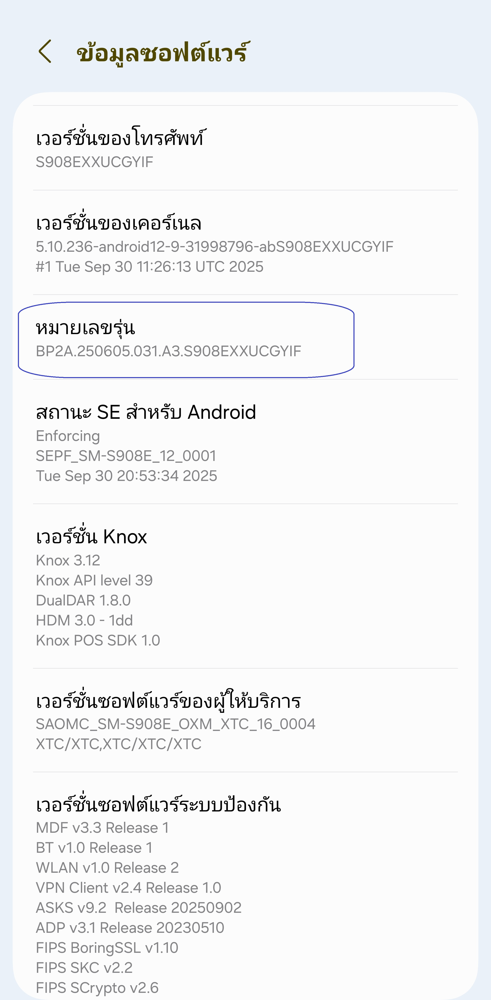
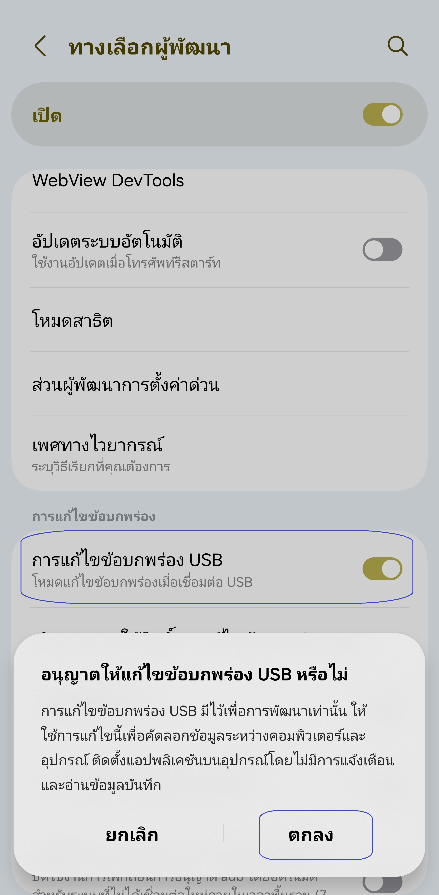
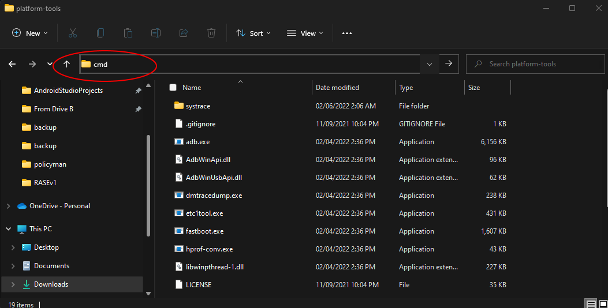
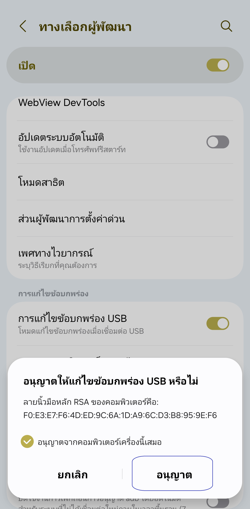
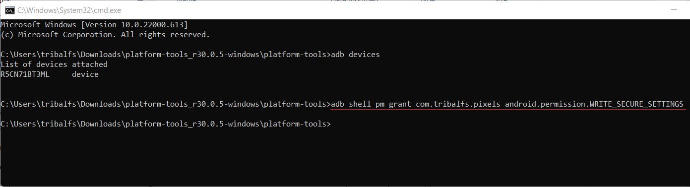

[English](../../README.md) | [Español](../es/README.md)
| [Português](../pt/README.md) | [Bahasa Indonesia](../in/README.md)
| [Русский](../ru/README.md) | [中文 (简体)](../zh-rCN/README.md)
| [日本語](../ja-rJP/README.md) | [Tiếng Việt](../vi/README.md)
| [Türkçe](../tr/README.md)
| [हिन्दी](../hi/README.md) | [العربية](../ar/README.md) | <u>[ไทย](../th/README.md)</u>

# Pixels - ตัวปรับความละเอียดและ DPI อัจฉริยะ

* [Google Play Store](https://play.google.com/store/apps/details?id=com.tribalfs.pixels)

แอป Pixels ต้องการสิทธิ์ **WRITE_SECURE_SETTINGS** เพื่อให้ทำงานได้ (ไม่ใช่การรูทเครื่อง)

----------------------

### TL;DR

* รันคำสั่ง `adb shell pm grant com.tribalfs.pixels android.permission.WRITE_SECURE_SETTINGS`
* หากใช้แอปเทอร์มินัลบน Android ที่มีสิทธิ์ระดับสูง ให้รันคำสั่ง  
  `pm grant com.tribalfs.pixels android.permission.WRITE_SECURE_SETTINGS`

----------------------

ขั้นตอน ADB โดยใช้คอมพิวเตอร์:
----------------------

<details>

### 1. เปิดโหมดนักพัฒนา (Developer Mode) ในการตั้งค่าของโทรศัพท์

<details>

* ไปที่ _การตั้งค่า_ > _เกี่ยวกับโทรศัพท์_ > _ข้อมูลซอฟต์แวร์_ และแตะ _หมายเลขบิลด์_ ติดต่อกันเจ็ด (
    7) ครั้ง เพื่อเปิดใช้งานตัวเลือกสำหรับนักพัฒนา

  

</details>

### 2. เปิดการดีบัก USB (USB Debugging)

<details>

* ไปที่ _การตั้งค่า (Settings)_ > _ตัวเลือกสำหรับนักพัฒนา (Developer options)_  
  (อาจอยู่ที่ _การตั้งค่า (Settings)_ > _ระบบ (System)_ > _ตัวเลือกสำหรับนักพัฒนา (Developer
  options)_ ใน Android รุ่นเก่า)  
  เลื่อนลงและเปิดใช้งาน _การดีบัก USB (USB debugging)_

  

#### หมายเหตุสำหรับบางอุปกรณ์ เช่น MIUI:

* เปิด _USB Debugging (Security Settings)_ หากมีตัวเลือกนี้ในเมนูนักพัฒนา

* เปิด _Disable permission monitoring_ หากมีตัวเลือกนี้ด้วย (จำเป็นต้องรีสตาร์ทเครื่อง)

</details>

### 3. ดาวน์โหลด ADB ลงในคอมพิวเตอร์ของคุณ

<details>

* ดาวน์โหลด ADB (platform-tools) มายังคอมพิวเตอร์ของคุณ:  
  สำหรับ [Windows](https://dl.google.com/android/repository/platform-tools-latest-windows.zip) |  
  สำหรับ [Mac](https://dl.google.com/android/repository/platform-tools-latest-darwin.zip) |  
  สำหรับ [Linux](https://dl.google.com/android/repository/platform-tools-latest-linux.zip)

* แตกไฟล์ ZIP ที่ดาวน์โหลดมา

</details>

### 4. ไปยังโฟลเดอร์

เปิดโฟลเดอร์ `platform-tools` ที่คุณแตกไว้ใน Windows Explorer หรือ Finder (macOS)

### 5. เปิดหน้าต่างคำสั่ง (Command Line Interface)

<details>

#### สำหรับ Windows: เปิด CMD

* พิมพ์ `cmd` ในแถบที่อยู่ แล้วกด Enter เพื่อเปิด Command Prompt



#### สำหรับ macOS: เปิด Terminal

* ค้นหา `Terminal` จาก Launchpad แล้วเปิดขึ้นมา
* พิมพ์ `sudo -s` และใส่รหัสผ่านผู้ใช้ของคุณ  
  **Terminal จะไม่แสดงอักขระที่คุณพิมพ์**
* จากนั้นรัน `export PATH=.:$PATH`

**หากไม่ทำขั้นตอนนี้ คุณจะพบข้อผิดพลาด `adb: command not found`**

</details>

### 6. เชื่อมต่อโทรศัพท์กับคอมพิวเตอร์

<details>

* เมื่อเชื่อมต่อครั้งแรกในโหมดดีบัก USB จะมีการแจ้งเตือน _อนุญาตการดีบัก USB (Allow USB
  debugging)_  
  แตะ _อนุญาต (Allow)_ หรือ _ตกลง (OK)_
* คุณสามารถติ๊ก _อนุญาตเสมอจากคอมพิวเตอร์เครื่องนี้ (Always allow from this computer)_ ได้  
  (ดูหมายเหตุท้ายเอกสารเกี่ยวกับการเปิดดีบัก USB ไว้)

  

* ตรวจสอบการเชื่อมต่อโดยรันคำสั่งนี้ จากนั้นกด Enter — หากเชื่อมต่อสำเร็จจะมีหมายเลขอุปกรณ์แสดงขึ้น

> ```adb devices```


#### สำหรับ macOS:  ```./adb devices ```

* หากเชื่อมต่อไม่ได้ ลองเปลี่ยนพอร์ต USB หรือสายข้อมูล  
  หากยังไม่เชื่อมต่อ อาจเป็นเพราะคอมพิวเตอร์ไม่มีไดรเวอร์ USB ของโทรศัพท์  
  ตรวจสอบ [ไดรเวอร์ OEM ที่นี่](https://developer.android.com/studio/run/oem-usb#Drivers)  
  หลังติดตั้งแล้ว ให้รีสตาร์ทคอมพิวเตอร์และทำขั้นตอนที่ 6 อีกครั้ง

</details>

### 7. ให้สิทธิ์ WRITE_SECURE_SETTINGS กับแอป Pixels

<details>

* เมื่อเชื่อมต่อสำเร็จ ให้รันคำสั่งต่อไปนี้แล้วกด Enter  
  หากรันสำเร็จจะไม่มีผลลัพธ์ใด ๆ แสดงออกมา

> ```adb shell pm grant com.tribalfs.pixels android.permission.WRITE_SECURE_SETTINGS```

* หากพบข้อความ `adb.exe: more than one device/emulator...` ให้รันคำสั่งนี้แทน:

>
```adb -s [รหัสอุปกรณ์จากขั้นตอนที่ 6] shell pm grant com.tribalfs.pixels android.permission.WRITE_SECURE_SETTINGS```



#### สำหรับ macOS:

```./adb shell pm grant com.tribalfs.pixels android.permission.WRITE_SECURE_SETTINGS ```

#### หมายเหตุสำหรับ MIUI, OnePlus และอุปกรณ์บางรุ่นอื่น ๆ

หากพบข้อผิดพลาด `java.lang.SecurityException: grantRuntimePermission` ให้ทำดังนี้:

1. ไปที่ _การตั้งค่า_ > _ตัวเลือกสำหรับนักพัฒนา_
2. เปิด **USB Debugging (Security Settings)**
3. หากมีหน้าต่างเตือน ให้ทำตามคำแนะนำ
4. รีสตาร์ทเครื่อง แล้วลองขั้นตอนที่ 7 อีกครั้ง

**เรียบร้อยแล้ว!**
</details>

#### ตอนนี้คุณสามารถปิดการดีบัก USB ได้แล้ว

* **สำคัญ:** ควรเปิดดีบัก USB ไว้
  หากคุณต้องการทดลองเปลี่ยนความละเอียดหน้าจอแบบพิเศษที่อาจทำให้ระบบค้าง  
  ต้องเลือก _Always allow from this computer_ ในขั้นตอนที่ 6  
  คำสั่ง ADB เพื่อรีเซ็ตความละเอียดหน้าจอ:  
  `adb shell wm size reset` และ `adb shell wm density reset`

* หากไม่จำเป็นต้องใช้แล้ว สามารถปิดดีบัก USB เพื่อความปลอดภัยได้

* ไปที่ _การตั้งค่า_ > _ตัวเลือกสำหรับนักพัฒนา_ แล้วปิด _การดีบัก USB_

----------------------
[วิดีโอแนะนำ (VIDEO GUIDE)](https://youtu.be/hKxc8wqanxA)

</details>

----------------------

ขั้นตอน ADB โดยไม่ใช้คอมพิวเตอร์:
----------------------
<details>

### ตัวเลือก 1: ติดตั้ง [Shizuku](https://play.google.com/store/apps/details?id=moe.shizuku.privileged.api)

และเปิดใช้งานตามคำแนะนำในแอป จากนั้นกลับไปที่แอป _Pixels_ เพื่อให้สิทธิ์โดยการปรับความละเอียดหน้าจอ

### ตัวเลือก 2: ติดตั้ง [LADB](https://github.com/tribalfs/LADB/releases)

ทำตามคู่มือการตั้งค่า และรันคำสั่งต่อไปนี้:

`pm grant com.tribalfs.pixels android.permission.WRITE_SECURE_SETTINGS`

**หมายเหตุ:** ต้องเชื่อมต่อกับเครือข่าย Wi-Fi  
หากพบข้อผิดพลาด `java.lang.SecurityException` ให้ตรวจสอบหมายเหตุในขั้นตอนที่ 2 ด้านบน  
**สำคัญ:** บางครั้ง **LADB** ต้องลองหลายครั้งถึงจะใช้งานได้ และอาจไม่สามารถทำงานได้กับทุกอุปกรณ์

</details>

----------------------

### ไม่จำเป็นต้องทำขั้นตอนนี้ซ้ำอีก เว้นแต่ว่าคุณจะถอนการติดตั้งแอปแล้วติดตั้งใหม่อีกครั้ง
