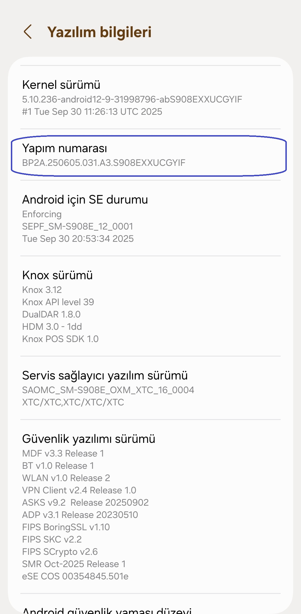
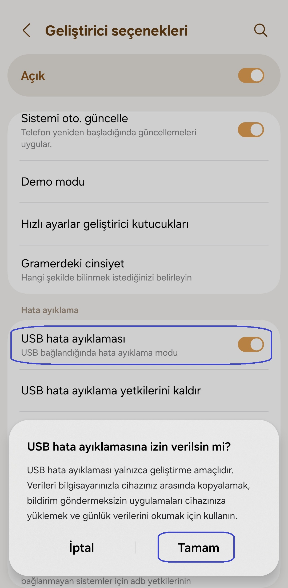
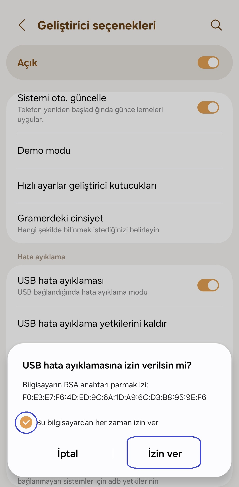

[English](../../README.md) | [Español](../es/README.md)
| [Português](../pt/README.md) | [Bahasa Indonesia](../in/README.md)
| [Русский](../ru/README.md) | [中文 (简体)](../zh-rCN/README.md)
| [日本語](../ja-rJP/README.md) | [Tiếng Việt](../vi/README.md)
| <u>[Türkçe](README.md)</u>
| [हिन्दी](../hi/README.md) | [العربية](../ar/README.md) | [ไทย](../th/README.md)

# Pixels - Akıllı Çözünürlük ve DPI Değiştirici

* [Google Play Store](https://play.google.com/store/apps/details?id=com.tribalfs.pixels)

Pixels'in çalışması için **WRITE_SECURE_SETTINGS** izni gerekir (bu, root işlemi DEĞİLDİR).

----------------------

### Özet

* `adb shell pm grant com.tribalfs.pixels android.permission.WRITE_SECURE_SETTINGS` komutunu
  çalıştırın.
* Yükseltilmiş izne sahip bir android terminal uygulaması kullanıyorsanız,
  `pm grant com.tribalfs.pixels android.permission.WRITE_SECURE_SETTINGS` komutunu çalıştırın.

----------------------

PC kullanarak ADB Prosedürleri:
----------------------

<details>

### 1. Telefon ayarlarında geliştirici modunu etkinleştirin

<details>

* _Ayarlar_ > _Telefon hakkında_ > _Yazılım bilgileri_ bölümüne gidin ve geliştirici seçeneklerini
  etkinleştirmek için _Yapı numarası_'na yedi (7) kez art arda dokunun.

  

</details>

### 2. USB hata ayıklamasına etkinleştirin

<details>

* _Ayarlar_ > _Geliştirici seçenekleri_ (eski android sürümlerinde _Ayarlar_ > _Sistem_ >
  _Geliştirici seçenekleri_ olabilir) bölümüne gidin, aşağı kaydırın ve _USB hata ayıklaması_
  seçeneğini bulun.

  

#### MIUI gibi bazı cihazlar için notlar:

* Geliştirici seçeneğinde mevcutsa _Güvenlik Ayarları için USB hata ayıklamayası_ da açın.

* Geliştirici seçeneklerinde mevcutsa _İzin İzlemeyi Devre Dışı Bırak_ seçeneğini açın. Yeniden
  başlatma gerekir.

</details>

### 3. ADB'yi bilgisayarınıza indirin

<details>

* ADB'yi (platform-tools) bilgisayarınıza indirin:
  [Windows](https://dl.google.com/android/repository/platform-tools-latest-windows.zip) için |
  [Mac](https://dl.google.com/android/repository/platform-tools-latest-darwin.zip) için |
  [Linux](https://dl.google.com/android/repository/platform-tools-latest-linux.zip) için

* İndirilen zip dosyasını çıkarın.

</details>

### 4. Windows Gezgini veya Finder'da (macOS) ayıkladığınız `platform-tools` klasörünün içine gidin

### 5. Komut satırı arayüzünü açma

  <details>

#### Windows için: CMD'yi açın

* Adres çubuğuna `cmd` yazın ve enter'a basın. Bu, Windows Komut İstemi uygulamasını açacaktır.


#### MacOS için: Terminal'i açın

* Launchpad'den `Terminal`'i arayın ve çalıştırın.

* `sudo -s` komutunu çalıştırın ve kullanıcı şifrenizi yazın. **Terminal, yazdığınız karakter
  sayısını göstermez, boş kalır.**

* `export PATH=.:$PATH` komutunu çalıştırın

**Bu olmadan `adb: command not found` hataları alırsınız.**

</details>

### 6. Telefonunuzu bilgisayarınıza bağlama

  <details>

* Telefonunuzda USB hata ayıklamasi modunda ilk kez bağlanıyorsa _USB hata ayıklamaya izin verilsin
  mi?_ istemi görüntülenir. _İzin Ver_ veya _Tamam_'a dokunun.
* _Bu bilgisayardan her zaman izin ver_ seçeneğini işaretleyebilirsiniz (USB hata ayıklamanın etkin
  tutulmasıyla ilgili bu eğitimin sonundaki nota bakın).

  

* Aşağıdaki komutu girip enter'a basarak bağlantıyı kontrol edin. Başarıyla bağlanırsa cihaz
  kimliğinizi göstermelidir.

> ```adb devices```


#### macOS için:  ```./adb devices ```

* Cihazınız bilgisayarınıza bağlanamazsa, farklı bir USB bağlantı noktasına bağlamayı ve/veya farklı
  bir USB veri kablosu kullanmayı deneyin. Hala bağlanmıyorsa, bilgisayarınızda telefonunuz için USB
  sürücüsü eksik
  olabilir. [OEM USB sürücülerini indirmek için burayı kontrol edin](https://developer.android.com/studio/run/oem-usb#Drivers).
  Yüklendikten sonra bilgisayarınızı yeniden başlatın ve 6. adımı yeniden yapın.

</details>

### 7. Pixels'e WRITE_SECURE_SETTINGS izninin fiilen verilmesi

  <details>

* Başarıyla bağlandığında, aşağıdaki komutu girin ve enter'a basın. Aşağıdaki komutu
  kopyalayabilirsiniz. Komut düzgün bir şekilde yürütülürse, boş dönecektir.

> ```adb shell pm grant com.tribalfs.pixels android.permission.WRITE_SECURE_SETTINGS```

* `adb.exe: more than one device/emulator...` istemi verirse, bunun yerine aşağıdakini yürütün:

>
```adb -s [6. adımda gösterilen cihaz kimliği] shell pm grant com.tribalfs.pixels android.permission.WRITE_SECURE_SETTINGS```


#### macOS için:

```./adb shell pm grant com.tribalfs.pixels android.permission.WRITE_SECURE_SETTINGS ```

#### MIUI, OnePlus ve diğer bazı cihazlar için not

`java.lang.SecurityException: grantRuntimePermission` Hatası alırsanız, şu adımları izleyin:

1. _Ayarlar_ > _Geliştirici seçenekleri_ ( _Ayarlar_ > _Sistem_ > _Geliştirici seçenekleri_
   olabilir) bölümüne gidin
2. Aşağı kaydırın ve **USB Hata Ayıklamayı (Güvenlik Ayarları)** etkinleştirin
3. Herhangi bir _Uyarı İletişim Kutusu_ görünürse, devam etmek için adımlarını izleyin.
4. Cihazınızı yeniden başlatın ve Bölüm 7 adımlarını tekrar deneyin.

**İşte bu kadar!**
</details>

#### Artık USB hata ayıklama ayarlarını devre dışı bırakabilirsiniz

* **Önemli**: Cihazınızda sistemi çökertme potansiyeli olan egzotik ekran çözünürlüklerini denemek
  istiyorsanız USB hata ayıklamayı etkin tutun. 6. adımda _Bu bilgisayardan her zaman izin ver_
  seçeneği işaretlenmelidir. Ekran çözünürlüğünü sıfırlamak için ADB komutları:
  `adb shell wm size reset` ve `adb shell wm density reset`.

* USB hata ayıklamaya ihtiyacınız yoksa, olası istenmeyen erişimi önlemek için artık USB hata
  ayıklama ayarlarını devre dışı bırakabilirsiniz.

* _Ayarlar_ > _Geliştirici seçenekleri_ bölümüne gidin, bir sayfa aşağı kaydırın ve _USB hata
  ayıklama_ seçeneğini **devre dışı bırakın**.

----------------------
[VİDEO KILAVUZU](https://youtu.be/hKxc8wqanxA)

----------------------
</details>

----------------------
PC kullanmadan ADB Prosedürleri:
----------------------
<details>

### Seçenek 1: [Shizuku](https://play.google.com/store/apps/details?id=moe.shizuku.privileged.api)'yu yükleyebilir

ve sağladığı kılavuzu izleyerek etkinleştirebilirsiniz. Ardından, bir çözünürlük uygulayarak izin
vermek için _Pixels_ uygulamasına geri dönün.

### Seçenek 2: [LADB](https://github.com/tribalfs/LADB/releases)'yi yükleyebilir

ve kurulum kılavuzunu takip edip aşağıdaki komutu çalıştırabilirsiniz:

`pm grant com.tribalfs.pixels android.permission.WRITE_SECURE_SETTINGS`

Not: Bu, bir wifi ağına bağlanmayı gerektirir. Bir java.lang.SecurityException hatası alırsanız,
yukarıdaki 2. adımdaki notları kontrol edin. Önemli: LADB bazen çalışması için birkaç deneme
gerektirir ve tüm cihazlarda çalışmayabilir.

</details>


----------------------

### Uygulamayı tamamen kaldırıp yeniden yüklemediğiniz sürece bu işlemi tekrarlamanız gerekmez.


