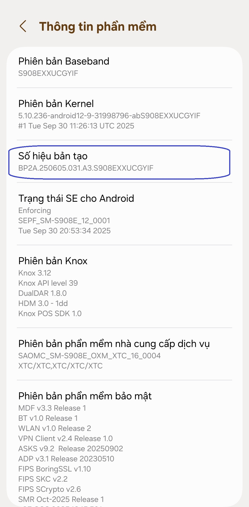
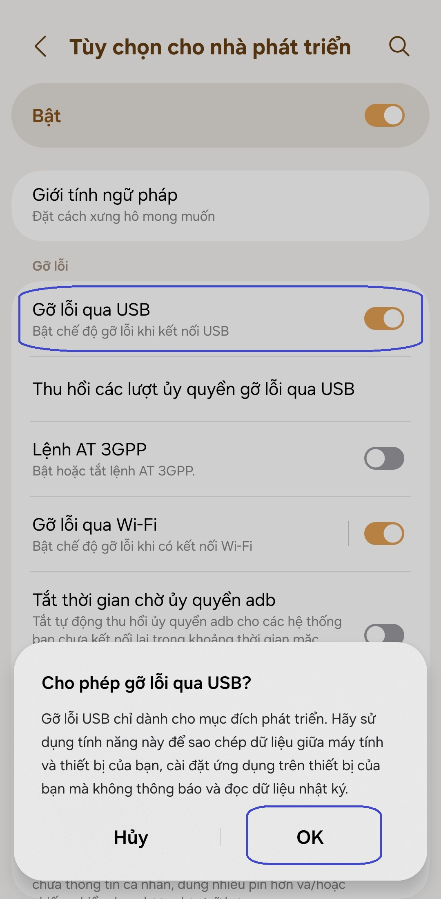
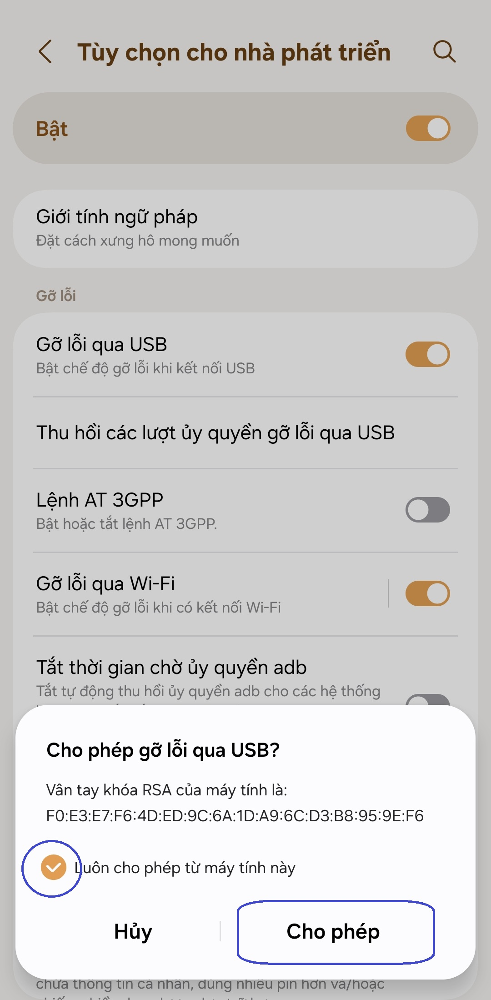

[English](../../README.md) | [Español](../es/README.md)
| [Português](../pt/README.md) | [Bahasa Indonesia](../in/README.md)
| [Русский](../ru/README.md) | [中文 (简体)](../zh-rCN/README.md)
| [日本語](../ja-rJP/README.md) | <u>[Tiếng Việt](README.md)</u>
| [हिन्दी](../hi/README.md) | [العربية](../ar/README.md) | [ไทย](../th/README.md)

# Pixels - Trình thay đổi độ phân giải và DPI thông minh

* [Cửa hàng Google Play](https://play.google.com/store/apps/details?id=com.tribalfs.pixels)

Pixels cần quyền **WRITE_SECURE_SETTINGS** để hoạt động (đây KHÔNG phải là root).

----------------------

### Tóm tắt

* Thực thi `adb shell pm grant com.tribalfs.pixels android.permission.WRITE_SECURE_SETTINGS`.
* Nếu sử dụng ứng dụng terminal android có quyền nâng cao, hãy thực thi
  `pm grant com.tribalfs.pixels android.permission.WRITE_SECURE_SETTINGS`.

----------------------

Quy trình ADB sử dụng PC:
----------------------

<details>

### 1. Bật chế độ nhà phát triển trong cài đặt của điện thoại

<details>

* Vào _Cài đặt_ > _Giới thiệu về điện thoại_ > _Thông tin phần mềm_ và nhấn vào _Số hiệu bản tạo_
  liên tục bảy (7) lần để bật tùy chọn nhà phát triển.

  

</details>

### 2. Bật gỡ lỗi USB

<details>

* Vào _Cài đặt_ > _Tùy chọn nhà phát triển_ (có thể là _Cài đặt_ > _Hệ thống_ > _Tùy chọn nhà phát
  triển_ trên các phiên bản Android cũ hơn), cuộn xuống và tìm tùy chọn _Gỡ lỗi qua USB_.

  

#### Ghi chú cho một số thiết bị như MIUI:

* Bật _Gỡ lỗi qua USB cho Cài đặt bảo mật_ nếu có trong tùy chọn Nhà phát triển.

* Bật tùy chọn _Tắt giám sát quyền_ nếu có trong tùy chọn Nhà phát triển. Cần khởi động lại.

</details>

### 3. Tải xuống ADB trên máy tính của bạn

<details>

* Tải ADB (platform-tools) về máy tính của bạn:
  cho [Windows](https://dl.google.com/android/repository/platform-tools-latest-windows.zip) |
  cho [Mac](https://dl.google.com/android/repository/platform-tools-latest-darwin.zip) |
  cho [Linux](https://dl.google.com/android/repository/platform-tools-latest-linux.zip)

* Giải nén tệp zip đã tải xuống.

</details>

### 4. Điều hướng đến bên trong thư mục

`platform-tools` mà bạn đã giải nén trên Windows Explorer hoặc Finder(macOS)

### 5. Mở giao diện dòng lệnh

  <details>

#### Đối với Windows: Mở CMD

* Nhập `cmd` vào thanh địa chỉ và nhấn enter. Thao tác này sẽ mở ứng dụng Dấu nhắc lệnh của Windows.


#### Đối với MacOS: Mở Terminal

* Tìm kiếm `Terminal` từ Launchpad và chạy nó.

* Chạy `sudo -s` và nhập mật khẩu người dùng của bạn. **Thiết bị đầu cuối sẽ không hiển thị bạn nhập
  bao nhiêu ký tự, nó sẽ trống.**

* Chạy `export PATH=.:$PATH`

**Nếu không có điều này, bạn sẽ gặp lỗi `adb: command not found`.**

</details>

### 6. Kết nối điện thoại với máy tính của bạn

  <details>

* Điện thoại của bạn sẽ nhắc _Cho phép gỡ lỗi USB_ nếu đây là lần đầu tiên được kết nối ở chế độ gỡ
  lỗi USB. Nhấn vào _Cho phép_ hoặc _OK_.
* Bạn có thể chọn _Luôn cho phép từ máy tính này_ (Vui lòng xem ghi chú ở cuối hướng dẫn này về việc
  bật gỡ lỗi USB).

  

* Kiểm tra kết nối bằng cách nhập lệnh sau rồi nhấn enter. Nó sẽ hiển thị ID thiết bị của bạn nếu
  kết nối thành công.

> ```adb devices```


#### Đối với macOS:  ```./adb devices ```

* Nếu thiết bị của bạn không kết nối được với máy tính, hãy thử kết nối thiết bị với một cổng USB
  khác và/hoặc sử dụng một cáp dữ liệu USB khác. Nếu vẫn không kết nối được, có thể máy tính của bạn
  bị thiếu trình điều khiển USB cho điện thoại của bạn. Kiểm
  tra [tại đây để tải xuống trình điều khiển USB OEM](https://developer.android.com/studio/run/oem-usb#Drivers).
  Sau khi cài đặt, hãy khởi động lại PC của bạn và thực hiện lại bước số 6.

</details>

### 7. Cấp thực tế quyền WRITE_SECURE_SETTINGS cho Pixels

  <details>

* Khi kết nối thành công, hãy nhập lệnh sau và nhấn enter. Bạn có thể sao chép lệnh bên dưới. Nếu
  lệnh được thực thi đúng cách, nó sẽ trả về giá trị trống.

> ```adb shell pm grant com.tribalfs.pixels android.permission.WRITE_SECURE_SETTINGS```

* Nếu nó nhắc `adb.exe: more than one device/emulator...`, hãy thực thi lệnh sauแทน:

>
```adb -s [device Id shown in step 6] shell pm grant com.tribalfs.pixels android.permission.WRITE_SECURE_SETTINGS```


#### Đối với macOS:

```./adb shell pm grant com.tribalfs.pixels android.permission.WRITE_SECURE_SETTINGS ```

#### Lưu ý đối với MIUI, OnePlus và một số thiết bị khác

Nếu bạn gặp lỗi `java.lang.SecurityException: grantRuntimePermission`, hãy làm theo các bước sau:

1. Vào _Cài đặt_ > _Tùy chọn nhà phát triển_ (có thể là _Cài đặt_ > _Hệ thống_ > _Tùy chọn nhà phát
   triển_
2. Cuộn xuống và bật **Gỡ lỗi USB (Cài đặt bảo mật)**
3. Nếu có bất kỳ _Hộp thoại thận trọng_ nào xuất hiện, hãy làm theo các bước của nó để tiếp tục.
4. Khởi động lại thiết bị của bạn và thử lại các bước của Phần 7.

**Thế là xong!**
</details>

#### Bây giờ bạn có thể tắt cài đặt gỡ lỗi USB

* **Quan trọng**: Luôn bật gỡ lỗi USB nếu bạn muốn thử các độ phân giải màn hình lạ trên thiết bị
  của mình có thể làm hỏng hệ thống. _Luôn cho phép từ máy tính này_ phải được chọn ở bước 6. Lệnh
  ADB để đặt lại độ phân giải màn hình: `adb shell wm size reset` và `adb shell wm density reset`.

* Nếu bạn không cần gỡ lỗi USB, bây giờ bạn có thể tắt cài đặt gỡ lỗi USB để tránh truy cập không
  mong muốn tiềm ẩn.

* Vào _Cài đặt_ > _Tùy chọn nhà phát triển_, cuộn xuống một trang và **tắt** tùy chọn _Gỡ lỗi USB_.

----------------------
[HƯỚNG DẪN BẰNG VIDEO](https://youtu.be/hKxc8wqanxA)

----------------------
</details>

----------------------
Quy trình ADB không cần sử dụng PC:
----------------------
<details>

### Tùy chọn 1: Bạn có thể cài đặt [Shizuku](https://play.google.com/store/apps/details?id=moe.shizuku.privileged.api)

và kích hoạt nó theo hướng dẫn được cung cấp. Sau đó, quay lại ứng dụng _Pixels_ để cấp quyền cho nó
bằng cách áp dụng độ phân giải.

### Tùy chọn 2: Bạn có thể cài đặt [LADB](https://github.com/tribalfs/LADB/releases)

và làm theo hướng dẫn thiết lập của nó và thực thi lệnh sau:

`pm grant com.tribalfs.pixels android.permission.WRITE_SECURE_SETTINGS`

Lưu ý: Điều này yêu cầu kết nối với mạng wifi. Nếu gặp java.lang.SecurityException, hãy kiểm tra các
ghi chú ở bước 2 ở trên. Quan trọng: LADB đôi khi cần thử vài lần để hoạt động và nó có thể không
hoạt động trên tất cả các thiết bị.

</details>


----------------------

### Bạn không cần phải lặp lại quá trình này trừ khi bạn gỡ cài đặt hoàn toàn ứng dụng và cài đặt lại.


