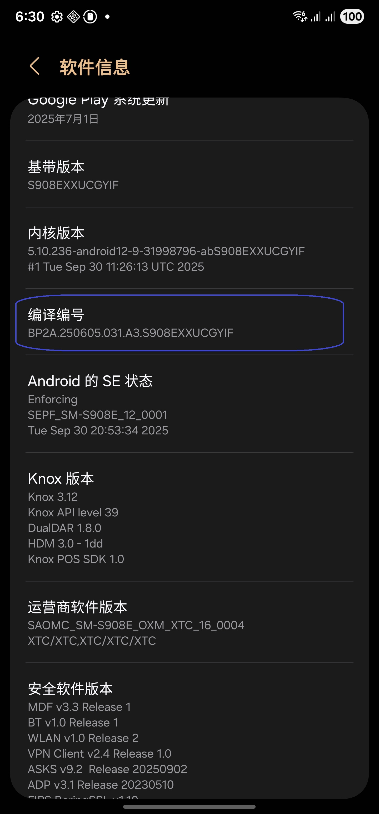
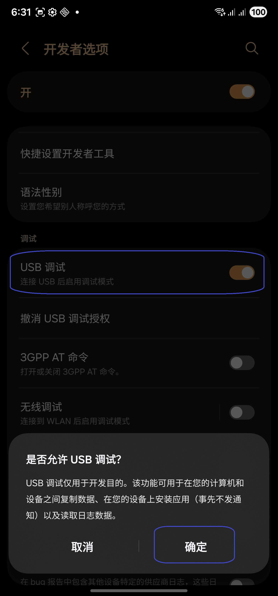
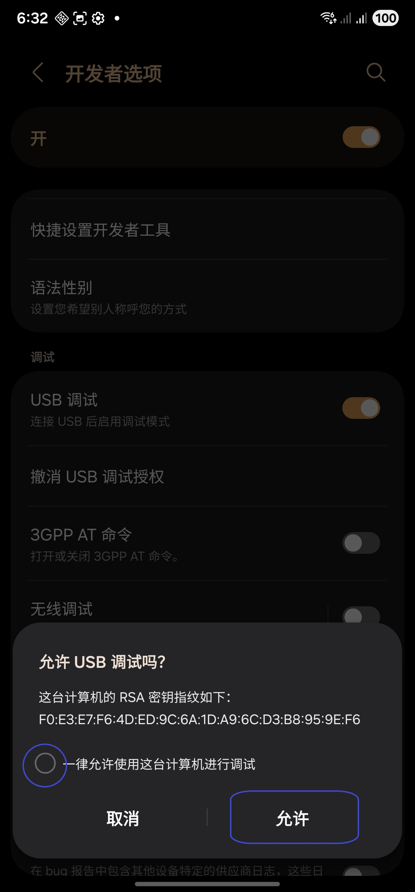
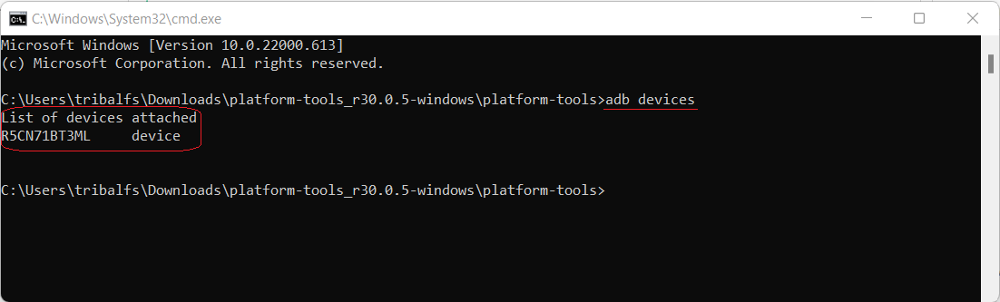

[English](../../README.md) | [Español](../es/README.md)
| [Português](../pt/README.md) | [Bahasa Indonesia](../in/README.md)
| [Русский](../ru/README.md) | <u>[中文 (简体)](README.md)</u>
| [日本語](../ja-rJP/README.md) | [Tiếng Việt](../vi/README.md)
| [हिन्दी](../hi/README.md) | [العربية](../ar/README.md) | [ไทย](../th/README.md)

# Pixels - 智能分辨率和 DPI 更改器

* [Google Play 商店](https://play.google.com/store/apps/details?id=com.tribalfs.pixels)

Pixels 需要 **WRITE_SECURE_SETTINGS** 权限才能工作（这不是 rooting）。

----------------------

### 太长不看

* 执行 `adb shell pm grant com.tribalfs.pixels android.permission.WRITE_SECURE_SETTINGS`。
* 如果使用具有提升权限的 android 终端应用程序，
  执行 `pm grant com.tribalfs.pixels android.permission.WRITE_SECURE_SETTINGS`。

----------------------

使用 PC 的 ADB 过程：
----------------------

<details>

### 1. 在手机设置中启用开发者模式

<details>

* 转到“_设置_”>“_关于手机_”>“_软件信息_”，然后连续点击“_版本号_”七 (7) 次以启用开发者选项。
* 

</details>

### 2. 启用 USB 调试

<details>

* 进入“设置” > “开发者选项”（在
  旧版 android 上可以是“设置” > “系统” > “开发者选项”），向下滚动并找到“USB 调试”选项。

  

#### 某些设备（如 MIUI）的注意事项：

* 如果“开发者选项”中存在“USB 调试（安全设置）”，也请打开。

* 如果“开发者选项”中存在“禁用权限监控”选项，请打开。需要重新启动。

</details>

### 3. 在您的计算机上下载 ADB

<details>

* 将 ADB (platform-tools) 下载到您的计算机：
  [Windows 版](https://dl.google.com/android/repository/platform-tools-latest-windows.zip) |
  [Mac 版](https://dl.google.com/android/repository/platform-tools-latest-darwin.zip) |
  [Linux 版](https://dl.google.com/android/repository/platform-tools-latest-linux.zip)

* 解压缩下载的 zip 文件。

</details>

### 4. 导航到

您在 Windows 资源管理器或 Finder(macOS) 中解压缩的 `platform-tools` 文件夹

### 5. 打开命令行界面

<details>

#### 对于 Windows：打开 CMD

* 在地址栏中键入 `cmd` 并按 Enter。这将打开 Windows 命令提示符
  应用程序。


#### 对于 macOS：打开终端

* 从启动台搜索“终端”并运行它。

* 运行 `sudo -s` 并输入您的用户密码。**终端不会显示您
  键入的字符数，它将保持空白。**

* 运行 `export PATH=.:$PATH`

**否则，您将收到 `adb: command not found` 错误。**

</details>

### 6. 将手机连接到计算机

<details>

* 如果是第一次在 USB 上连接
  调试模式，您的手机将提示“允许 USB 调试”。点按“允许”或“确定”。
* 您可以选中“始终允许从此计算机”（请在
  本教程末尾查看有关保持启用 USB 调试的说明）。

  

* 通过输入以下命令并按 Enter 来检查连接。如果连接成功，它应该会显示您的
  设备 ID。

```adb devices```



#### 对于 macOS：  ```./adb devices ```

* 如果您的设备无法连接到您的计算机，请尝试将其连接到其他 USB 端口和/或
  使用不同的 USB 数据线。如果仍然无法连接，则您的计算机可能缺少
  您手机的 USB 驱动程序。
  在此处[下载 OEM USB 驱动程序](https://developer.android.com/studio/run/oem-usb#Drivers)。
  安装后，重新启动您的 PC 并重做第 6 步。

</details>

### 7. 实际授予 Pixels WRITE_SECURE_SETTINGS 权限

<details>

* 连接成功后，输入以下命令并按 Enter。您可以复制
  下面的命令。如果命令执行正确，它将返回空白。

```adb shell pm grant com.tribalfs.pixels android.permission.WRITE_SECURE_SETTINGS```

* 如果提示 `adb.exe: more than one device/emulator...`，请改为执行以下命令：

>
```adb -s [device Id shown in step 6] shell pm grant com.tribalfs.pixels android.permission.WRITE_SECURE_SETTINGS```


#### 对于 macOS：

```./adb shell pm grant com.tribalfs.pixels android.permission.WRITE_SECURE_SETTINGS ```

#### MIUI、OnePlus 和其他一些设备的注意事项

如果您收到 `java.lang.SecurityException: grantRuntimePermission` 错误，请按照以下步骤操作：

1. 进入“设置” > “开发者选项”（可以是“设置” > “系统” > “开发者选项”）
2. 向下滚动并启用 **USB 调试（安全设置）**
3. 如果出现任何“警告对话框”，请按照其步骤进行操作。
4. 重新启动您的设备并重试第 7 节的步骤。

**就是这样！**
</details>

#### 您现在可以禁用 USB 调试设置

* **重要提示**：如果您想在您的
  设备上尝试可能会使系统崩溃的奇异屏幕分辨率，请保持启用 USB 调试。应在
  步骤 6 中选中“始终允许从此计算机”。重置屏幕分辨率的 ADB 命令：`adb shell wm size reset`
  和 `adb shell wm density reset`。

* 如果您不需要 USB 调试，您现在可以禁用 USB 调试设置以避免潜在的
  不必要的访问。

* 进入“设置” > “开发者选项”，向下滚动一页并 **禁用** “USB 调试”选项。

----------------------
[视频指南](https://youtu.be/hKxc8wqanxA)

----------------------
</details>

----------------------
不使用 PC 的 ADB 过程：
----------------------
<details>

### 选项 1：您可以安装 [Shizuku](https://play.google.com/store/apps/details?id=moe.shizuku.privileged.api)

并按照其提供的指南激活它。然后返回“Pixels”应用以通过
应用分辨率来授予其权限。

### 选项 2：您可以安装 [LADB](https://github.com/tribalfs/LADB/releases)

并按照其设置指南执行以下命令：

`pm grant com.tribalfs.pixels android.permission.WRITE_SECURE_SETTINGS`

注意：这需要连接到 wifi 网络。如果出现 java.lang.SecurityException，请检查
上面的步骤 2 中的注意事项。重要提示：LADB 有时需要尝试几次才能使其工作，并且它可能
无法在所有
设备上工作。

</details>


----------------------

### 除非您完全卸载并重新安装该应用程序，否则您不必重复此过程。
